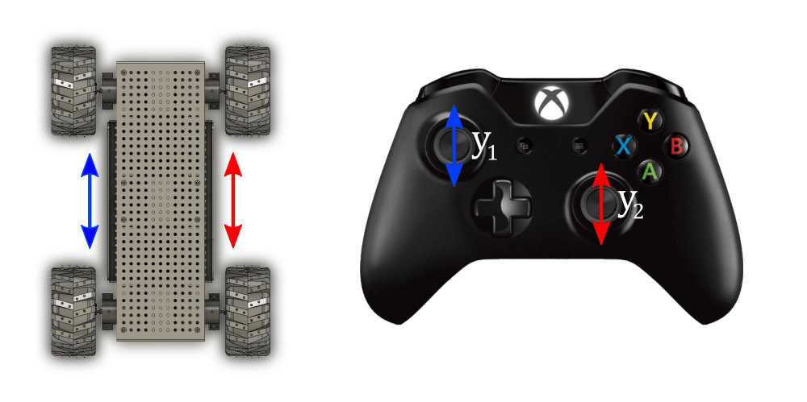
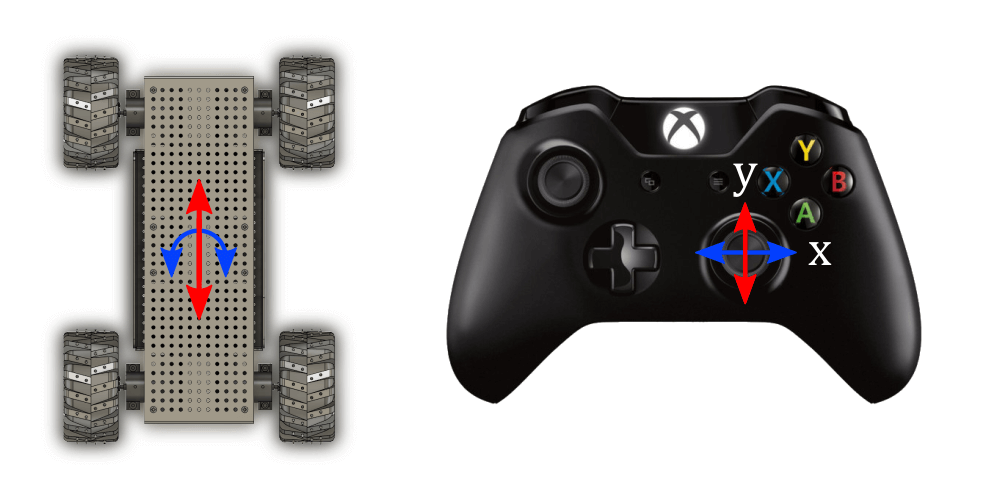

# Arcade Drive (Servo Motors)

There are two classic ways of controlling a 2 or 4 wheeled rover that has a tank drive drivetrain. 

From [xiaoxiae on Github](https://xiaoxiae.github.io/Robotics-Simplified-Website/drivetrain-control/tank-drive/):

Tank drive is a method of controlling the motors of a tank drive drivetrain using two axes of a controller, where each of the axes operate motors on one side of the robot. 



In contrast, Arcade drive is a method of controlling the motors of a tank drive drivetrain using two axes of a controller, where one of the axes controls the speed (throttle) of the robot, and the other the steering (spin) of the robot.



---

### Rover Setup
Your rover needs the following hardware:
- Flysky receiever
- x2 Rotational servo motors, orientated in tank drive where x1 of the motor sides in inverted/mirrored

# Video Tutorial



---

# Text Tutorial

### Required Library

Before moving forward, ensure you have the following [arcade_drive_servo.py](arcade_drive_servo.py) and [rc.py](../rc_module/rc.py) py files on your `CIRCUITPY` lib folder.

---

## Example Code

```python
import board
import time
from rc import RCReceiver
from arcade_drive_servo import Drive

rc = RCReceiver(ch1=board.D10, ch2=board.D11, ch3=None, ch4=None, ch5=board.D12, ch6=board.D13)
drive = Drive(left_pin=board.D2, right_pin=board.D3, left_stop=0.0, right_stop=0.0)

channels = [1,2,5,6]

# Main code
while True:
    # Read joystick channels
    spin = rc.read_channel(1) # spin
    throttle = rc.read_channel(2) # throttle

    if spin is not None and throttle is not None: # must not be None to do something with the output
        drive.drive(spin,throttle)
        print("spin", spin, "throttle", throttle) # move our motors arcade drive style


    time.sleep(0.02)  # Maintains sync with our 20ms cycle every loop iteration

```

## Code Breakdown

### Importing Necessary Libraries

```python

import board
import time
from rc import RCReceiver
from arcade_drive_servo import Drive
```

- **board**: This library provides board-specific constants to specify pins used for input and output. It's essential to identify which pins on the board connect to devices.
- **time**: This library allows us to use time-related functions, especially `sleep`.
- **RCReceiver** and **Drive**: These are imported from custom modules. `RCReceiver` is used to handle the input from the RC receiver, while `Drive` is used to control the driving mechanism of the robot.

### Setting Up the RC Receiver and Drive

```python
rc = RCReceiver(ch1=board.D4, ch2=board.D5, ch3=None, ch4=None, ch5=board.D6, ch6=board.D7)
drive = Drive(left_pin=board.D2, right_pin=board.D3, left_stop=0.0, right_stop=0.0)
```

- The **RCReceiver** is initialized with different channels corresponding to different board pins. 
- The **Drive** is set up with pins controlling the left and right servo motors. 
    - The pwm servo objects are initialized in the library itself, not in your `code.py` file. 
    - `left_stop` and `right_stop` values are set to zero. You can calibrate these values if you find they stop value of `0.0` is not actually causing your servo to stop. [servo stop calibration tutorial]

### Main Code Loop

The code enters an infinite loop, constantly checking for input from the RC receiver and updating the drive system accordingly.

```python
while True:
    # Read joystick channels
    spin = rc.read_channel(1)  # spin
    throttle = rc.read_channel(2)  # throttle

    if spin is not None and throttle is not None:  # Ensures valid input
        drive.drive(spin, throttle)  # Moves the motors based on input
    print("spin", spin, "throttle", throttle)  # Displays the current input values

    time.sleep(0.02)  # Maintains sync with our 20ms cycle every loop iteration
```

- **Reading Channels**: The code reads channel 1 for `spin` and channel 2 for `throttle` to get joystick input.
- **Checking Inputs**: It checks if the inputs are not `None` (meaning valid and connected inputs).
- **Driving Motors**: If valid data is read, the `drive` function is called to control the motors according to the joystick's direction and throttle.
- **Print Statement**: This outputs the current values of `spin` and `throttle` to the console for debugging purposes.
- **Delay**: A short delay of 20-40 ish milliseconds is added to match the RC receiver's duty cycle and avoid overwhelming the processor with too many instructions in a short period.

## Conclusion

This code effectively allows for controlling a robot using an RC receiver and servo motors. It's crucial to ensure that the pins and channels are correctly configured to match your hardware setup.
