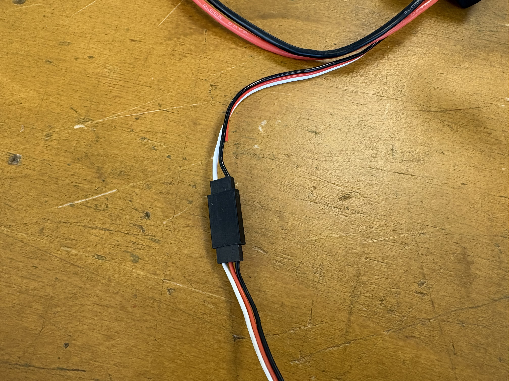
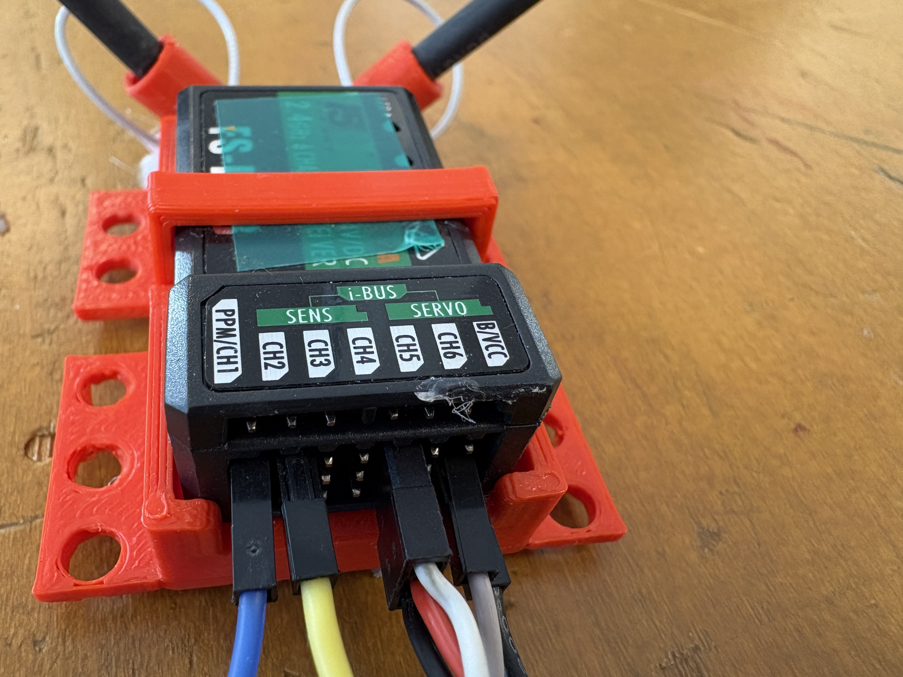

# Wiring Your Intake Motor Controller

This tutorial wires a single DC motor to a goBILDA 1x20A motor controller and drives it from your transmitter. You will use one switch to turn the motor on at full power, and off. You will not write any code.

By the end, you flip a switch on your transmitter and your intake motor spins at full power. Flip it back and the motor stops.

> **Note:** this builds on top of the wiring already on your robot. Your receiver and 12V battery circuit should already be connected before you start this tutorial.

***

# What You Need

- goBILDA 1x20A motor controller
- One DC motor for the intake
- One servo extension cable with the middle wire already cut (ask your teacher, see Step 1)
- Zip ties or M3 bolts
- Access to your robot's receiver and 12V battery circuit

> **Safety rule:** the motor jumps straight to full power the instant the switch flips. There is no ramp-up. Keep hands, clothing, and loose material clear of the intake mechanism every time you power up.

***

# Step 1: Get Your Servo Extension Cable

The goBILDA controller outputs power on the middle wire of its signal connector. This is meant to power a receiver that has no other power source. Your receiver already gets its power from somewhere else on the robot. Two power sources feeding the same rail can damage it.

Because of this, the middle wire on the servo extension cable needs to be cut before you connect it. **Do not cut this wire yourself.** Ask your teacher for a cable that has already been prepped, or bring your cable to your teacher and ask them to confirm the middle wire is cut before you use it.

A correctly prepped cable looks like the photo below: the outer two wires (signal and ground) run end to end, and the middle wire is cut and taped off partway along the cable.

***

# Step 2: Wire the Motor Controller

1. Connect the intake motor's two wires to the controller's motor output bullet connectors. The direction doesn't matter yet. You set final direction in Step 6.
2. Connect the controller's power input to your robot's 12V battery circuit. The connector is keyed, so it only fits one way.
3. Plug one end of your prepped servo extension cable into the **Ch5** pin row on the receiver.
4. Plug the other end into the signal port on the goBILDA controller.

***

# Step 3: Mount the Controller and Motor

1. Zip tie or bolt the motor controller to the chassis.
2. Mount the intake motor to its bracket or mechanism.
3. Route every wire away from anything that spins: the motor shaft, gears, belts, or the intake mechanism itself.

Push on the controller and the motor mount by hand. Nothing should shift.

***

# Step 4: Check Channel 5 on the Transmitter

Channel 5 is controlled by the **SwB** toggle switch on the transmitter, a 2-way switch (top left). Flip it both directions and confirm the transmitter's screen shows a channel 5 value change. If it doesn't move, stop here and check the transmitter's AUX channel settings before continuing. Check in with your teacher on this respect. 

***

# Step 5: Power Up and Test

1. Push every toggle switch on the transmitter, including SwB, all the way DOWN (off).
2. Turn on the transmitter.
3. Connect the robot's 12V battery.
4. Flip SwB on. The intake motor spins at full power.
5. Flip SwB off. The motor stops.

> **Power-on order matters:** turn on the transmitter first, then connect the battery. Disconnect the battery first when you're done, then turn off the transmitter.

If the motor spins the wrong way for your intake, disconnect the battery, swap the motor's two bullet connectors at the controller, and reconnect. This reverses the motor's direction without touching the signal wiring.

### Troubleshooting

| What you see | What to check |
|---|---|
| Motor never spins | Ask your teacher to confirm the servo cable's signal and ground wires are intact, and only the middle wire was cut |
| Motor spins the moment you connect the battery, before flipping SwB | SwB position. Push it all the way to one side before you connect power |
| Motor runs, but SwB does nothing | Ch5 wiring at the receiver. Confirm the servo cable is in the Ch5 row, not another channel |
| Motor spins the wrong direction | Swap the two motor bullet connectors at the controller output |
| Receiver acts strange after connecting the controller | Ask your teacher to recheck the cable. The middle wire must be fully cut, not just bent out of the connector |
