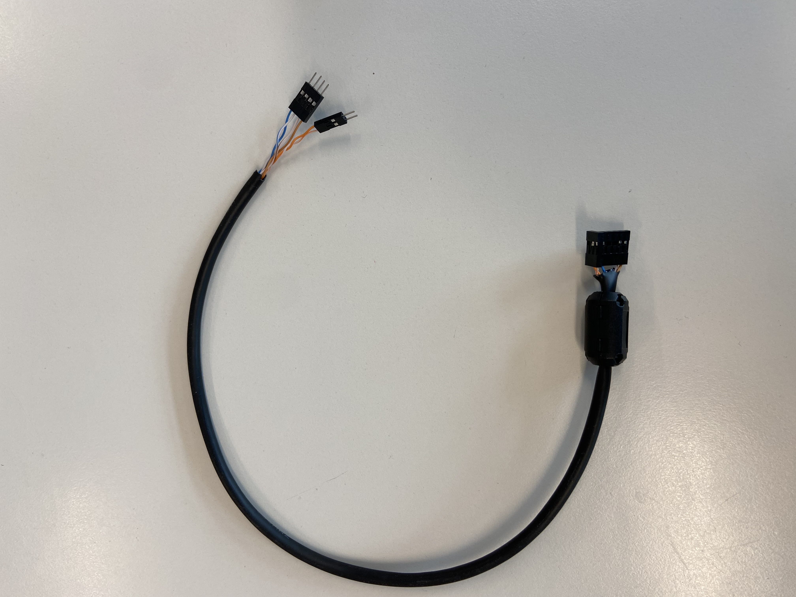
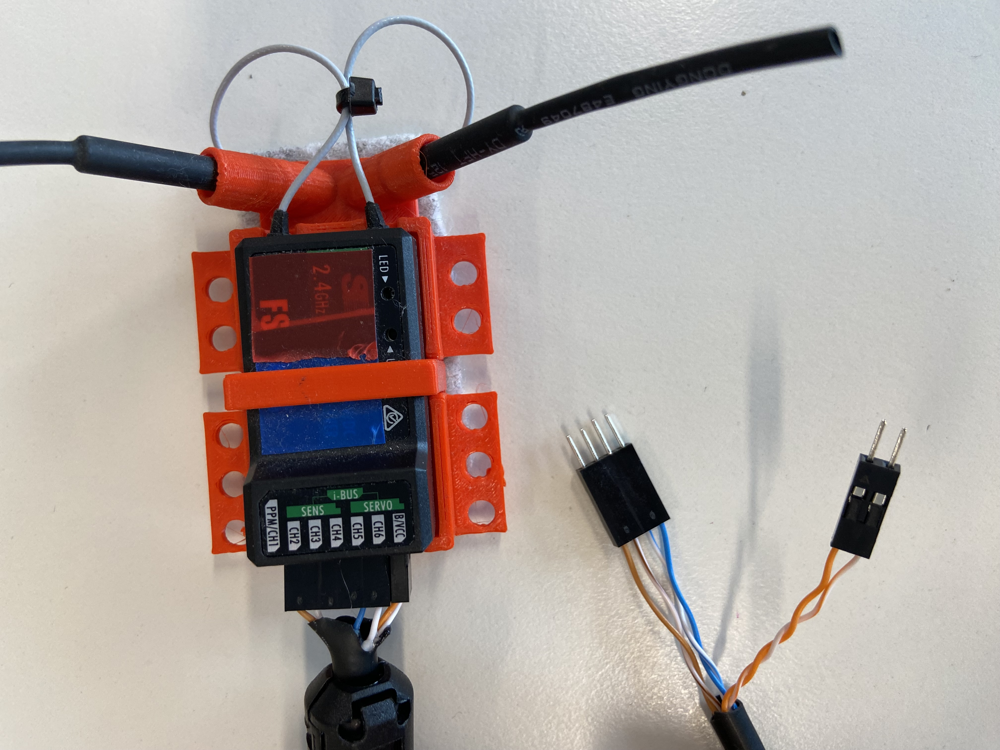
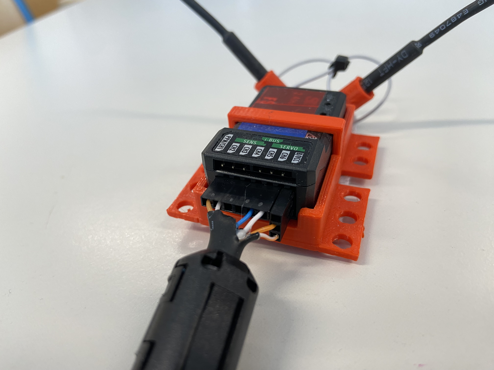
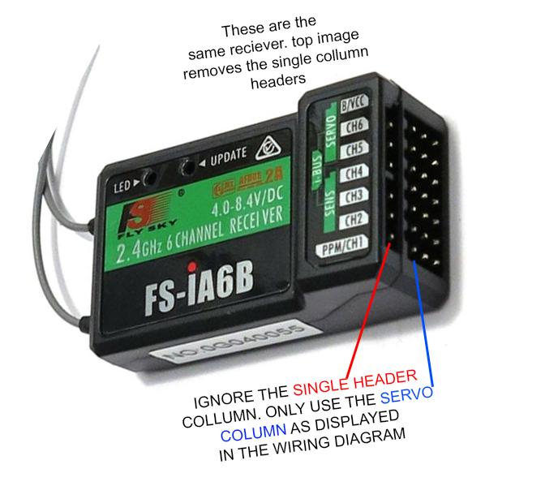

# CircuitPython - FlySky FS-I6X Controller - FS-iA6B Reciever
This page will show you how to use the `rc.py` library for controlling a FlySky FS-i6(X) controller with an FS-iA6B reciever in circuitpython. 

Let's get into remote controlled rovers! We will start simple and build up to a full state-machine-controlled system.
1. Wiring the transmitter (video OR text tutorial)
2. Programming the transmitter (ONLY text tutorial)

---

# 1. Transmitter & receiver Wiring/Controls

Option 1: Video tutorial. Option 2: Text Tutorial

The FlySky transmitter/receiver consists of 2 parts. The transmitter is the controller with the joysticks & switches, the receiver is the small box with the antenna. 

***

# Video Tutorial



***

## Controlling the FlySky Transmitter

### Powering on
As this is a drone controller, it has a few safeguards in place to prevent your robot from immediately driving off or turning on it's attack mechanisms. Your transmitter should have the following setup: 
- All toggle switches on the top of the transmitter should be pushed DOWN (the OFF state).
- Left joystick should be pulled all the way down
- Right joystick in the centre position


### Transmitter outputs
The transmitter can send values for 6 different channels at any one time. It does have the option to have up to x4 toggle switches, and x2 potentiometers, but this is the intended output for our controller in this class. 

- `Ch1` - Right joystick, Left/Right Control
- `Ch2` - Right joystick, Up/Down Control
- `Ch3` - Left joystick, Left/Right Control
- `Ch4` - Left joystick, Up/Down Control
- `Ch5` - SWB, 2 way toggle switch
- `Ch6` - SWC, 3 way toggle switch

Eventually, we will drive the robot throttle with CH2, and steer with CH1. CH3/4 will likely not be used, and CH 5/6 will be used for various mechanisms attached to our robot. 

***

## Wiring the receiver
It is important to know that the receiver outputs a 5V signal. However, our Metro board has both 3.3 and 5v logic pins (or 5V tolerant at least), meaning that we don't need to change voltage to read our signals. 

You'll need a wiring harness for the receiver, and the receiver itself
* The harness
    
* The receiver
    

You can simply attach the wiring harness into the reciver, so that:
* The channels can recieve signals from the antenna, and sends these as PWM signals to our microcontroller
    * Ch1 = Brown
    * Ch2 = Brown/White
    * Ch5 = Blue/White
    * Ch6 = Blue
* The "BCC" section of our receiver is how we provide 5V power to our receiver. 
    * 5V BCC (Battery) = Orange 
    * GND BCC (Battery) = Orange/White



* Note, there are 2 "rows" of pins on the receiver. we want to use the x3 horizontal pins, *not the x1 hotizonal pin row*
* This receiver is actually meant for you to attach Servos to, hence why we have x3 horizontal pins in rows. So we have a left Signal pin, middle 5V power, and Right GND. 


***

# 2. Programming the FLY-Sky
Now that you're wired up, lets program this board and start recieving signals. 

## Required Library
* Ensure you have added the [rc.py](../../circuit_python_libraries/lib/rc.py) file to your `CIRCUITPY` lib folder. 


## 1. Reading a Single Channel 1
To start, we will read only the horizontal movement of the right joystick (Channel 1). This channel returns a **float** (a decimal number) between **-1.0 and 1.0**. 
* **-1.0** is all the way to the left.
* **1.0** is all the way to the right.
* **0.0** is the "deadzone" (the center).
* You may find that you only return 0.9 or -0.9 as a max value. If this happens, talk to your teacher and they can help change the end-point ranges

```python
import time
import board
from rc import RCReceiver

# Initialize the receiver. We only care about Channel 1 for now.
# Connect the signal wire of Channel 1 on your receiver to D0.
rc = RCReceiver(ch1=board.D0)

while True:
    # Read the value of Channel 1
    spin = rc.read_channel(1)
                
    print("Steering (Ch 1):", spin)

    # CRITICAL: This 0.02 sleep is required to stay in sync with the PWM cycle.
    # Without this, the receiver readings will fail!
    time.sleep(0.02) 
```

### Experiment
Try to get the console to print exactly `0.0` by letting go of the stick. Then, try to hold it at exactly `0.5`.

<details>
<summary>Click to reveal a hint</summary>
<pre><code>
# Make sure your RC Transmitter is turned on! 
# If you see "None" or errors, check that the signal wire is on D0 
# and the receiver has power (Red/Black wires).
</code></pre>
</details>

---

## 2. Adding the Second Axis (Channels 1 & 2)
Now let's add the vertical movement of the right joystick (Channel 2). Like Channel 1, this returns a value from **-1.0 to 1.0**.

```python
import time
import board
from rc import RCReceiver

# Initialize with two channels
rc = RCReceiver(ch1=board.D0, ch2=board.D1)

while True:
    spin = rc.read_channel(1)
    throttle = rc.read_channel(2)
                
    print("Ch1 (X):", spin, " | Ch2 (Y):", throttle)

    time.sleep(0.02) 
```

### Experiment
Create a script that prints "Forward" if the throttle (Ch 2) is greater than 0.5, and "Reverse" if it is less than -0.5.

<details>
<summary>Click to reveal a hint</summary>
<pre><code>
# Use an 'if' and 'elif' statement inside the loop.
# Compare the variable 'throttle' to the numbers 0.5 and -0.5.
</code></pre>
</details>

<details>
<summary>Click to reveal a solution</summary>
<pre><code>
while True:
    throttle = rc.read_channel(2)
    
    if throttle > 0.5:
        print("Forward")
    elif throttle < -0.5:
        print("Reverse")
    else:
        print("Neutral")
        
    time.sleep(0.02)
</code></pre>
</details>

---

# 3. Working with Switches (Channels 5 & 6)
Joysticks provide a range, but switches provide specific steps.
* **Channel 5** is a 2-way switch. It returns **0** or **1**.
* **Channel 6** is a 3-way switch. It returns **0**, **1**, or **2**.

```python
import time
import board
from rc import RCReceiver

# Initialize sticks and switches
rc = RCReceiver(ch1=board.D0, ch2=board.D1, ch5=board.D2, ch6=board.D3)

while True:
    ch1 = rc.read_channel(1)
    ch2 = rc.read_channel(2)
    sw_l = rc.read_channel(5)
    sw_r = rc.read_channel(6)
                
    print("Sticks:", ch1, ch2, " | Left Switch (2-way):", sw_l, " | Right Switch (3-way):", sw_r)

    time.sleep(0.02) 
```

### Experiment
Modify the code so that Channel 5 acts as a "Safety Switch." 
* If Channel 5 is **0**, print "SYSTEM DISARMED." 
* If Channel 5 is **1**, print the values of the Joysticks (Ch 1 and 2).

<details>
<summary>Click to reveal a hint</summary>
<pre><code>
# Wrap your print statements for Ch1 and Ch2 inside an 'if' statement.
# Check if the value of Channel 5 is equal to 1 (sw_a == 1).
</code></pre>
</details>

<details>
<summary>Click to reveal a solution</summary>
<pre><code>
while True:
    sw_a = rc.read_channel(5)
    
    if sw_a == 1:
        ch1 = rc.read_channel(1)
        ch2 = rc.read_channel(2)
        print("Active - X:", ch1, "Y:", ch2)
    else:
        print("SYSTEM DISARMED")
        
    time.sleep(0.02)
</code></pre>
</details>

---

# 4. RC State Machine Logic
In advanced robotics, we don't want to just "if/else" everything. We want to switch between different **modes of operation**. We can use the 3-way switch (Channel 6) to change the "State" of our robot.

### Experiment
Create a State Machine with three states: `"MANUAL"`, `"AUTO"`, and `"OFF"`. 
* Use **Channel 6** to switch states: 
    * 0 = `"OFF"`
    * 1 = `"MANUAL"`
    * 2 = `"AUTO"`
* In `"MANUAL"`, print the joystick values.
* In `"AUTO"`, print "Robot is thinking..."
* In `"OFF"`, print "Shutting down..."

<details>
<summary>Click to reveal a hint</summary>
<pre><code>
# 1. Create a variable called 'robot_state' and set it to "OFF" initially.
# 2. In the loop, read Channel 6. Use 'if/elif' to change the 'robot_state' string.
# 3. Create a second set of 'if/elif' statements to perform actions based on the string.
</code></pre>
</details>

<details>
<summary>Click to reveal a solution</summary>
<pre><code>
import time
import board
from rc import RCReceiver

rc = RCReceiver(ch1=board.D0, ch2=board.D1, ch6=board.D3)
robot_state = "OFF"

while True:
    # 1. Update State based on RC Switch
    mode_switch = rc.read_channel(6)
    
    if mode_switch == 0:
        robot_state = "OFF"
    elif mode_switch == 1:
        robot_state = "MANUAL"
    elif mode_switch == 2:
        robot_state = "AUTO"

    # 2. Perform actions based on State
    if robot_state == "MANUAL":
        x = rc.read_channel(1)
        y = rc.read_channel(2)
        print("Manual Control Mode -> X:", x, "Y:", y)
    
    elif robot_state == "AUTO":
        print("Autonomous Mode -> Robot is thinking...")
        
    elif robot_state == "OFF":
        print("System is OFF")

    time.sleep(0.02) 
</code></pre>
</details>