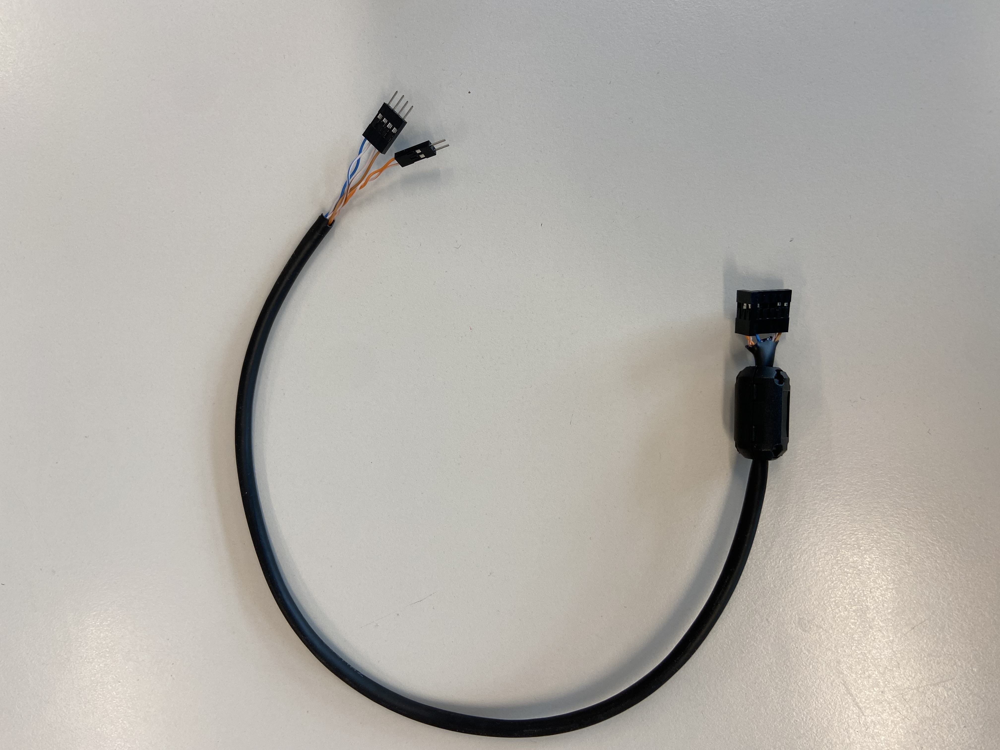

# Transmitter & receiver Wiring/Controls

The FlySky transmitter/receiver consists of 2 parts. The transmitter is the controller with the joysticks & switches, the receiver is the small box with the antenna. 

***

# Video Tutorial



***

# Text Tutorial

## Controling the FlySky Transmitter

### Powering on
As this is a drone controller, it has a few safeguards in place to prevent your robot from immediately driving off or turning on it's attack mechanisms. Your transmitter should have the following setup: 
- All toggle switches on the top of the transmitter should be pushed DOWN (the OFF state).
- Left joystick should be pulled all the way down
- Right joystick in the centre position

### Transmitter outputs
The transmitter can send values for 6 different channels at any one time. It does have the option to have up to x4 toggle switches, and x2 potentiometers, but this is the intended output for our controller in this class. 

- `Ch1` - Right joystick, Left/Right Control
- `Ch2` - Right joystick, Up/Down Control
- `Ch3` - Left joystick, Left/Right Control
- `Ch4` - Left joystick, Up/Down Control
- `Ch5` - SWB, 2 way toggle switch
- `Ch6` - SWC, 3 way toggle switch

Eventually, we will drive the robot throttle with CH2, and steer with CH1. CH3/4 will likely not be used, and CH 5/6 will be used for various mechanisms attached to our robot. 

***

## Wiring the receiver
It is important to know that the receiver outputs a 5V signal. However, our Metro board has both 3.3 and 5v logic pins (or 5V tolerant at least), meaning that we don't need to change voltage to read our signals. 

You'll need a wiring harness for the receiver, and the receiver itself
* The harness
    
* The receiver
    

You can simply attach the wiring harness into the reciver, so that:
* The channels can recieve signals from the antenna, and sends these as PWM signals to our microcontroller
    * Ch1 = Brown
    * Ch2 = Brown/White
    * Ch5 = Blue/White
    * Ch6 = Blue
* The "BCC" section of our receiver is how we provide 5V power to our receiver. 
    * 5V BCC (Battery) = Orange 
    * GND BCC (Battery) = Orange/White

* Note, there are 2 "rows" of pins on the receiver. we want to use the x3 horizontal pins, *not the x1 hotizonal pin row*
* This receiver is actually meant for you to attach Servos to, hence why we have x3 horizontal pins in rows. So we have a left Signal pin, middle 5V power, and Right GND. 

***
Now that you're wired up, lets program this board and start recieving signals. 

[Return to FlySky Tutorials](../learning_modules/Fly_sky_learning.md)