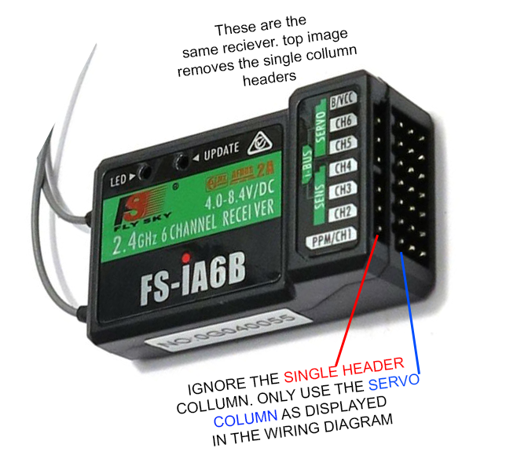
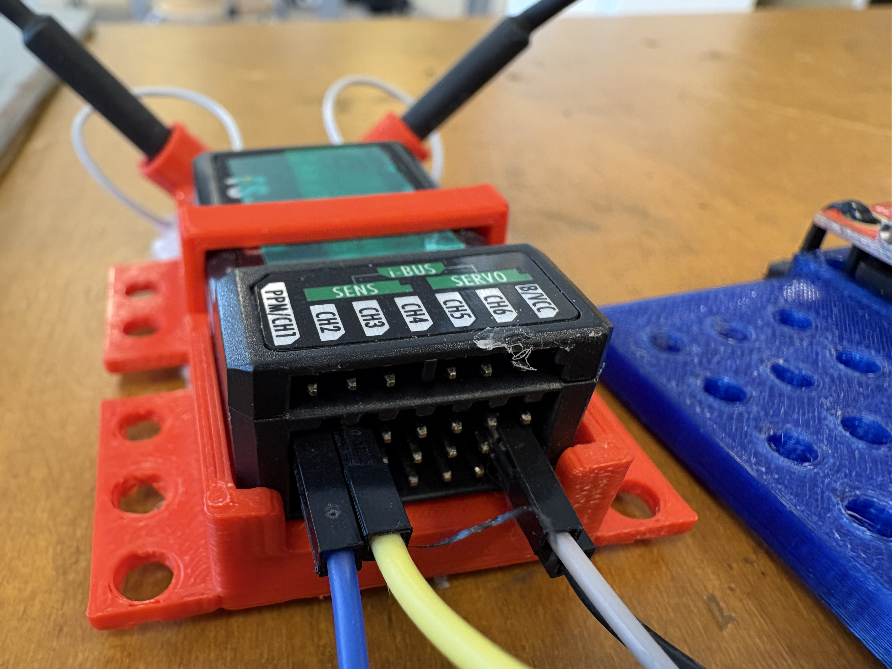
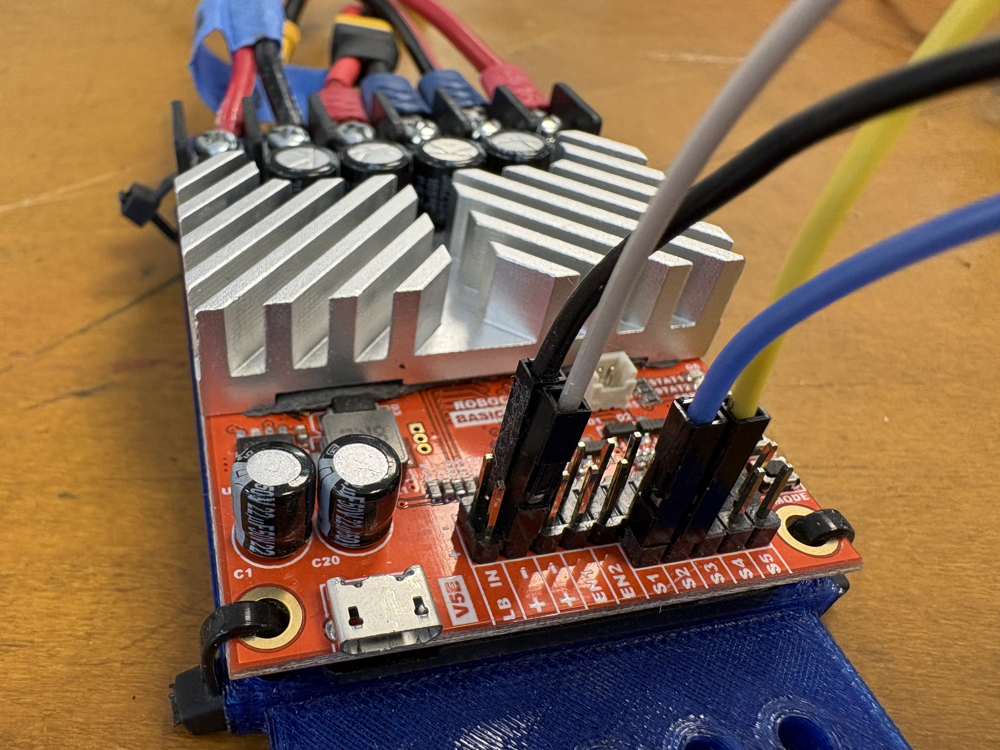

# CircuitPython - FlySky FS-I6X Controller - FS-iA6B Reciever

### Driving Your Robot: Wiring and RoboClaw Setup

Wire the receiver into the RoboClaw. The RoboClaw reads your transmitter and drives the motors on its own. You will not write any code.

By the end of this tutorial, your robot drives forward, drives backward, and turns, using only the transmitte (FlySky i6) and the RoboClaw.

***

# What You Need

- FlySky FS-i6X transmitter
- FlySky FS-iA6B receiver
- Female-to-female (F-F) jumper wires: single-pin for signal connections, plus one 3-pin for power
- RoboClaw motor controller
- 4 drive motors (2 per side), each side wired through a Y-splitter
- 12V battery
- Zip ties or M3 bolts
- A yellow toolbox (or similar stand) to hold the robot with its wheels off the ground

> **Safety rule for this tutorial:** keep the wheels off the ground until Step 6. Set the robot on the toolbox stand before you connect the battery. Once the battery and transmitter are both powered on, the robot can start driving immediately — keep hands, tools, and loose wires clear of the wheels every time you power up.

***

# Step 1: Wire the Receiver to the RoboClaw

The receiver reads your transmitter's radio signal and passes it to the RoboClaw. The RoboClaw uses that signal to drive the motors. The RoboClaw also powers the receiver, so one connection handles both signal and power.

### 1.1 — Connect the signal wires

1. Find the **Ch1** and **Ch2** pin rows on the receiver. Use the 3-pin horizontal rows, not the single pin row. On each row, the left pin is Signal, the middle pin is +5V, and the right pin is GND.
2. Take a single F-F jumper wire. Plug one end into the **left (Signal) pin** of the Ch1 row. Plug the other end into the **S1** signal input on the RoboClaw.
3. Take a second F-F jumper wire. Plug one end into the **left (Signal) pin** of the Ch2 row. Plug the other end into the **S2** signal input on the RoboClaw.
4. Leave the middle and right pins on the Ch1 and Ch2 rows empty. Step 1.2 powers the receiver a different way.

### 1.2 — Power the receiver from the RoboClaw
1. Find the top row on the receiver labeled **BCC**. This row has 3 pins.
2. Take a female-to-female 3-pin jumper cable.
3. Plug one end into the receiver's BCC row.
4. Plug the other end into the **+/− 5V** header on the RoboClaw.

> This is what your final wiring should look like

> **Warning:** connect the receiver to only one power source. Do not power the BCC row from a separate battery or regulator at the same time. Two power sources on one rail can damage the receiver.

Your receiver now draws power from the RoboClaw and sends its Ch1 and Ch2 signals to the RoboClaw's S1 and S2 inputs.

***

# Step 2: Wire the Battery and Drive Motors

1. On the right side of the robot, run both DC motors into a **Y-splitter**.
2. Plug the Y-splitter into the **M2** motor output on the RoboClaw.
3. On the left side of the robot, run both DC motors into a **Y-splitter**.
4. Plug the Y-splitter into the **M1** motor output on the RoboClaw.
5. Connect the 12V battery to the RoboClaw's main power input (B+ / B−). Check polarity before you connect it. If you are unsure which terminal is which, check the battery wiring tutorial before continuing.

Do not connect the battery yet if you have not finished Step 3. Mount the robot first.

***

# Step 3: Mount Everything to the Robot

1. Set the robot chassis on the yellow toolbox so no wheel touches the ground.
2. Zip tie or bolt the receiver to the chassis.
3. Zip tie or bolt the RoboClaw to the chassis.
4. Zip tie or bolt the 12V battery to the chassis.
5. Route the wires so none of them can reach a wheel or a gear while the motors spin.

Push on every mounted part by hand. Nothing should wobble or shift.

***

# Step 4: Power Up the RoboClaw and Set the Mixing Mode

Your RoboClaw has 3 buttons and several LEDs near them. The buttons select a mode number, and the LED blinks out that number so you can confirm your selection without a screen.

1. Connect the 12V battery to the RoboClaw.
2. Confirm the RoboClaw's power LED turns on.
3. Locate the 3 buttons on the RoboClaw board. Check the labels printed on the board (In order of Top to bottom "LIPO, SET, & MODE". 
4. Press "MODE" button until the mode LED starts blinking.
5. Press the Mode/SET buttons to move to the next mode. Count the LED's blinks after each press — the blink count tells you the current mode number.
6. Stop when the LED blinks out **x2**. This is RC input with mixing enabled: the RoboClaw reads S1 as steering and S2 as throttle, then calculates left and right motor speed on its own.
7. Press the LIPO button to save the mode.
8. Press "SET" button until the option LED starts blinking.
9. Press the Mode/SET buttons to move to the next mode. Count the LED's blinks after each press — the blink count tells you the current mode number.
10. Stop when the LED blinks out **x2**. 
11. Press the LIPO button to save the mode.

These modes are persistant across restarts & power offs. 

***

# Step 5: Power Up the Transmitter and Reverse Channel 2

### 5.1 — Power-on safeguards

Set up the transmitter before you turn it on:

- Push every toggle switch on top of the transmitter all the way DOWN (off).
- Pull the left joystick all the way down.
- Let go of the right joystick — it is spring-loaded and centers on its own.

Now turn on the transmitter.

> **Power-on order matters:** turn on the transmitter first, then connect the robot's battery. When you finish driving, disconnect the robot's battery first, then turn off the transmitter. A receiver that loses signal while the motors still have power can behave unpredictably. The instant both are on, the robot can drive off on its own if a stick isn't centered. Check stick positions before you connect the battery, not after.

### 5.2 — Reverse Channel 2

Channel 2 may drive the robot backward when you push the stick forward. Reverse it so forward on the stick means forward on the robot. If your robot drives backwards when driving:

1. Press and hold **OK** to enter the menu.
2. Press **DOWN** to highlight **Functions Setup**, then press **OK**.
3. Press **DOWN** to highlight **Reverse**, then press **OK**.
4. Press **OK** to select **Channel 2**.
5. Press **UP** or **DOWN** to toggle it to **REV**.
6. Press and **hold CANCEL** to save. A single tap of CANCEL exits the menu without saving, you have to hold it.
7. Press **CANCEL** a few more times to return to the main screen.

If Channel 2 still drives backward, repeat these steps and confirm the hold on CANCEL actually registered before you let go.

***

# Step 6: Test Driving

**Keep the robot on the toolbox stand for this entire step.**

Wheels stay off the ground. Powering on can make the robot move right away, so stand clear of the wheels before you connect the battery.

1. Connect the robot's battery.
2. Push the throttle stick forward. Both wheels on both sides spin the same direction, at matching speed.
3. Pull the throttle stick back. Both wheels spin the opposite direction, at matching speed.
4. Center the throttle stick, then push the steering stick left. The left wheels and right wheels spin in opposite directions, so the robot turns in place.
5. Push the steering stick right and watch the wheels reverse that pattern.

This is called **arcade mixing**: one stick axis for throttle, one for turning, combined by the RoboClaw into independent left and right motor speeds.

### Troubleshooting

| What you see | What to check |
|---|---|
| Nothing moves | S1/S2 wiring, the BCC power jumper, the RoboClaw mode setting |
| One side spins backward from the other | Swap that side's two motor leads at the RoboClaw output, or check the RoboClaw's motor direction setting |
| Both sides spin backward from what you expect | Reverse CH2 again (Step 5.2) and confirm the save |
| Turning works but forward/backward doesn't, or runs reversed | S1 and S2 wiring confirm they aren't swapped |
| Robot responds but jumps or twitches | The receiver's power connection a shared or noisy power source causes this |

Once forward, backward, and both turns work correctly with the wheels off the ground, set the robot down and test at low speed in an open, clear area.

