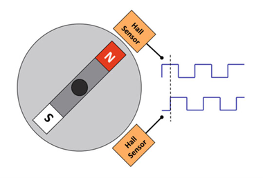
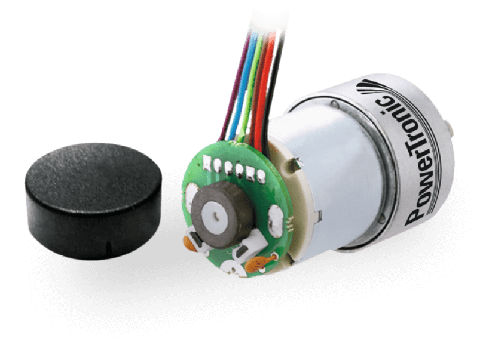
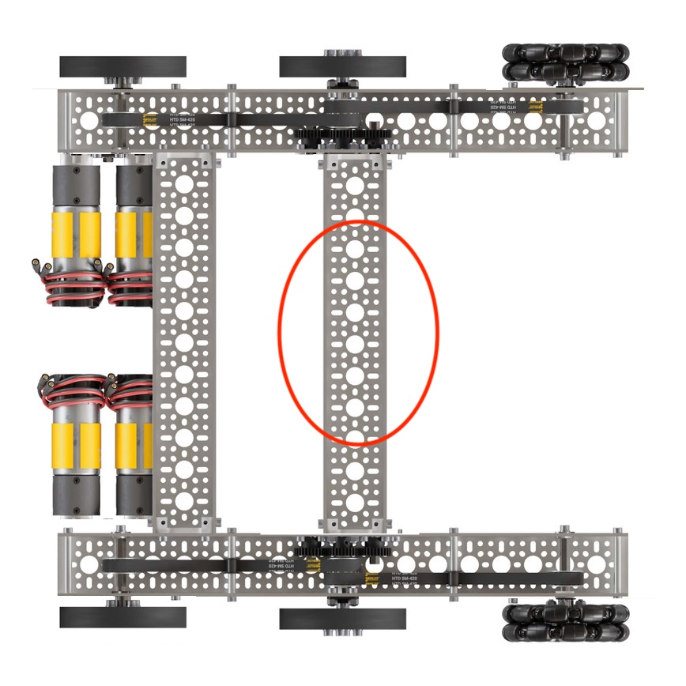
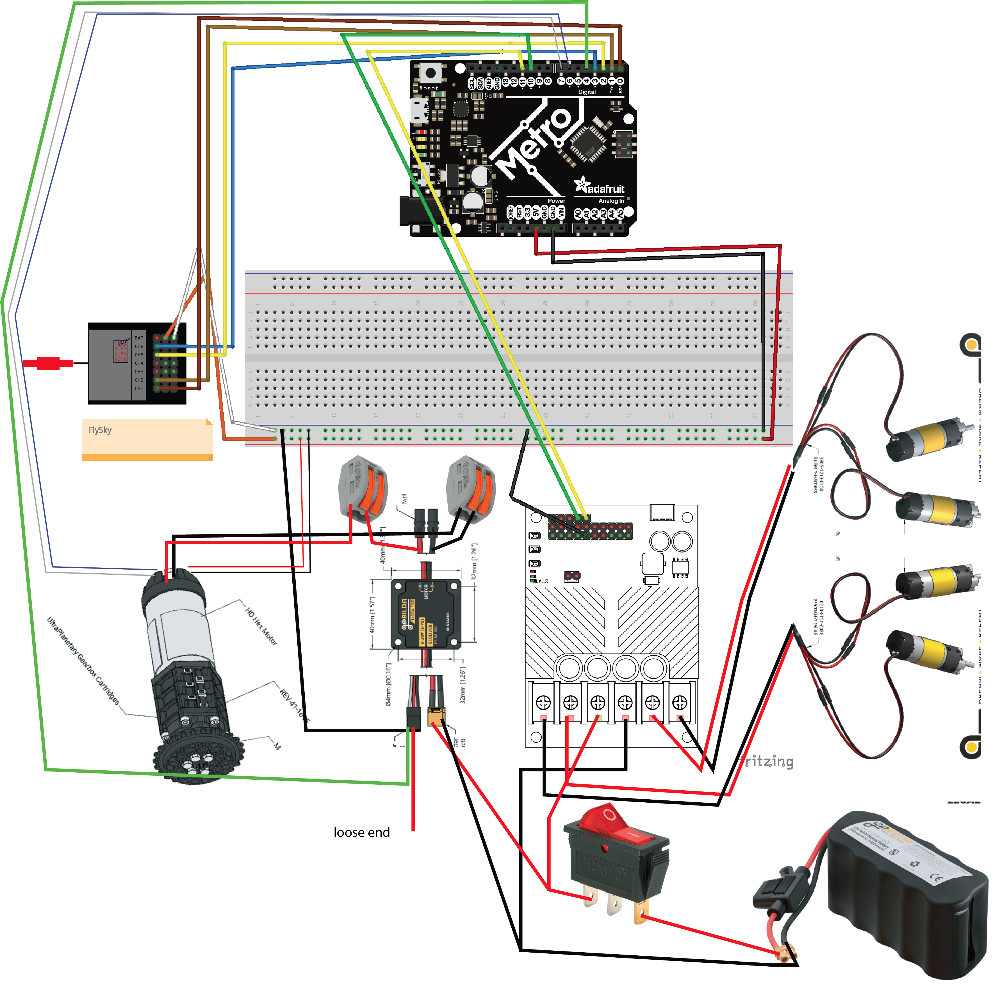

# Gear Ratio RPM Test

Let's test how efficient your system is, and how capable your system is at achieving the RPM you've created. We're going to wire up a few components to be able to test this:
1. DC motor + motor controller
2. Encoder wires to your DC motor

## What is a "motor encoder"? 
A Hall Effect motor encoder is a digital sensor that uses magnets to "see" how a motor is moving. Inside the motor, a small disk with magnets rotates along with the shaft, passing by a stationary sensor that sends an electrical pulse every time a magnetic pole flies past. By counting these pulses, your computer can figure out exactly how many times the motor has turned, how fast it is spinning (RPM), and which direction it is headed. Essentially, it acts like a high-speed digital speedometer and odometer, turning a simple motor into a precise tool that your code can monitor and control in real-time.




Your motor already has a built in hall effect encoder. We can easily connect this to our microcontroller using a JST pin connector. For example: 


--- 

## Wiring Diagram

**Before wiring, mount your gearbox securely to one of the cross braces of your rover**



Note: We are simply adding on to our current control board here. You'll notice that you've already wired the majority of the components needed, but now we are adding:
- 12V DC motor + Motor encoder wires (on back of motor)
- x1 20A motor controller

- Motor Controller
    - Power: 2nd output of the 12V batter
    - Servo output wire: GND > Breadboard, White > D4
- Motor Encoder
    - 5V > breadboard 5V rail
    - GND > breadboard GND rail
    - Blue > D6
    - White > D7



---

## Testing Code

Download the following [code](dc_flywheel_gearboxchallenge_encoder_test.py) onto your code.py file. This will disable the driving functions and ONLY run the gear box. 
- The serial port will count down from 3, 2, 1, before starting the flywheel for 5 seconds, before stopping. 
- Ensure you have the 12V power switch on
- Ensure you are watching the serial outputs
- Modulate Goal_RPM & Ratio values. save between each test. 

Your task is to change the Target RPM on the motor until you hit the target *output* RPM goal range.  

Look for the following section of code to enter in your gear ratio as a decimal number, and change your goal RPM to fit based on your calculations. 

```python
# === TODO CHANGES ===
# for each, set values higher or lower depending on your tests
FLYWHEEL_GOAL_RPM = 300 
GEAR_RATIO = 1.0 # set to 1.0 if no external gearing, otherwise set to your ratio
```