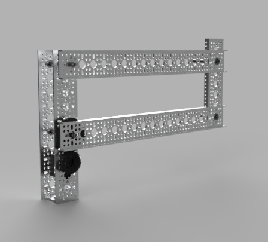

# 2bar & 4bar lifts

Once you've assembled your 2 or 4 bar lift, we'll use a simple servo program to make this lift move up and down. You'll need to calibrate your lift times to ensure that you're lifting in the correct direction, the appropriate speed, and for the correct amount of time. 

**Ensure your lift is stabilized well before continuing!** 



---

## Code

Taken from our the [continuous rotational servo tutorial](../physical_component_tutorials/servo_motors/ContinuousRotationalServos.md)

```python
import time
import board
import pwmio
from adafruit_motor import servo

# ----------------- INIT DEVICES -------------------------

# create a PWMOut object on Pin D0.
pwm = pwmio.PWMOut(board.D0, frequency=50)

# Create a servo object, my_servo.
my_servo = servo.ContinuousServo(pwm)

# calibration variables 

up_time = 1.0
up_speed = -0.2


down_time = 0.5
down_speed = 0.1

print("starting loop in 1 sec")
time.sleep(1)
while True:
    print("going up")
    my_servo.throttle = up_speed
    time.sleep(up_time)
    print("stop")
    my_servo.throttle = 0.0
    time.sleep(1.0)
    print("going down")
    my_servo.throttle = down_speed
    time.sleep(down_time)
    print("stop")
    my_servo.throttle = 0.0
    time.sleep(2.0)

```

### Examining the Code 

There are 4 main variables you will need to calibrate to ensure your lift works as expected:
```python

up_time = 1.0
up_speed = -0.2

down_time = 0.5
down_speed = 0.1
```

* You may need to reverse the speeds on the servos, to move the correct direction 
* Your up times & speeds are likely higher than your down, because of gravity