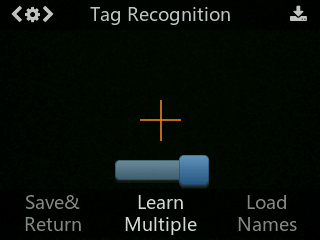
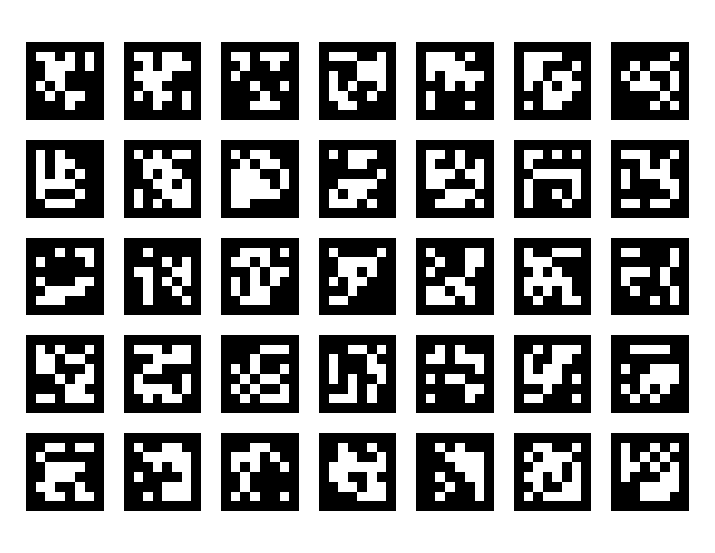
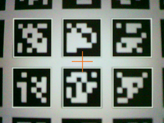
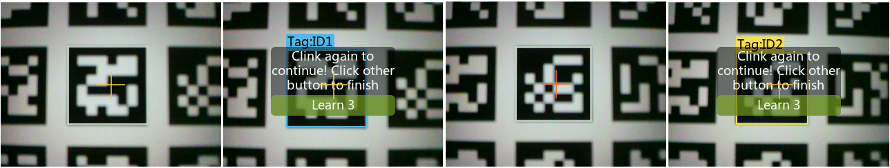
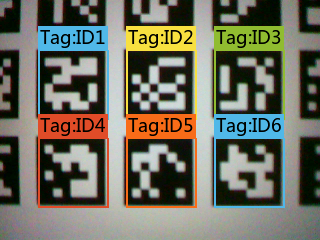

# April Tags

This mode can detect April tags, and learn, recognize, track specified tags. 

The default setting is to learn a single tag. This chapter uses learning, recognizing, and tracking multiple tags as an example to demonstrate.

## Video Tutorial



---

## Text Tutorial

## Operation and Settings
1. Dial the function button to the right or left until the words "Tag Recognition" are displayed at the top of the screen.
2. Long press the function button to enter the parameter setting of the tag recognition function.
3. Dial the function button until "Learn Multiple" is displayed, then short press the function button, and dial to the right to turn on the "Learn Multiple" switch, that is, progress bar turns blue and the square icon on the progress bar moves to the right. 4. Short press the function button to confirm this parameter.




5. Dial the function button to the left until "Save & Return" shows. When the screen prompts "Do you want to save the parameters?" Select "Yes". 
6. Short-press the function button to save the parameters and return automatically.

## Learning and Detection
We'll be using the april tags 36h11 family for our tests. The tags that I've used are 100mm x 100mm. 



### 1. Tag Detection:
When Huskylens detects the tag, the tag will be automatically selected by the white frame on the screen.



### 2. Tag Learning:
- Point the “+” symbol at the first tag, and press the “learning button”.
- A yellow frame with words "Tag:ID1" will be displayed on the screen, indicating that HuskyLens is learning the tag now. 
- Release the "learning button" to complete learning the first tag
- After learning, a message "Click again to continue! Click other button to finish" will be displayed. 
- Short press the "learning button" before the countdown ends to continue to learn other tags. 
- If done learning, let the countdown end.



### 3. Tag Recognition
When the husky lens finds a learned tag, some color frames with IDs will be automatically displayed on the screen. The size of the frames changes with the size of the tags, and the frames automatically track these tags.



*Note: The tag ID's are NOT the same as the april Tag ID's. Tag ID is default by the tag #learned first, sequentially.*

--- 

# Sample Code

The following code will display all tag details from all known tags shown in the camera's field of view (FOV). Run the following code on your microcontroller and verify that it works as you'd expect. 

```python

import board
from circuitPyHuskyLib import HuskyLensLibrary
import time

# create our husky lens object via i2c communication
hl = HuskyLensLibrary("I2C", SCL=board.SCL, SDA=board.SDA)

# verify that our husky lens is connected
time.sleep(1)

hl.algorithm("ALGORITHM_TAG_RECOGNITION") # switch to tag recognition mode

while True:
    results = hl.learnedBlocks()

    if results:
        for block in results:
            print("--------------------")
            print(f"ID: {block.ID}")
            print(f"Center X: {block.x}")
            print(f"Center Y: {block.y}")
            print(f"Width: {block.width}")
            print(f"Height: {block.height}")
    else:
        print("no recognized tags detected")

    time.sleep(5)
```

## Renaming Tag ID's

Understanding April tags by ID number is useful, but the sequential nature of the husky lens is not. It can be a bit annoying when tag 23 is ID1. Let's change that. We can rename what our tags display as.


Given the above image, we could recolour and rename our tags to the actual april tag number: 
- 21 :ID1
- 23 :ID2
- 24 :ID3 
- 27 :ID4 
- 29 :ID5
- 30 :ID6 

so that our ID's relate to the actual April tag #, rather than an arbitrary learned order. 

```python
import board
from circuitPyHuskyLib import HuskyLensLibrary
import time

# create our husky lens object via i2c communication
hl = HuskyLensLibrary("I2C", SCL=board.SCL, SDA=board.SDA)

# verify that our husky lens is connected
time.sleep(1)

hl.algorithm("ALGORITHM_TAG_RECOGNITION") # switch to tag recognition mode

hl.setCustomName("21 ", 01) # NEW tag name, ID number
# change the rest of your tag names here

while True:
    # ...
```

## Measuring Distance

We can also measure distance to our target, *provided we are looking straight on to our target*, using area. In short, when we're looking directly at the april tag, the april tag will take up a known area % of our target. We can create a simple "y look up table" to know that when the april tag is taking up X% of our screen, we are Xcm away from the target. 

> known heights at distances
> 100mm^2 april tags
> 
> (cm) - area %
> 
> 17 - 0.237292 |
> 27 - 0.0985417 |
> 49 - 0.02875 |
> 64 - 0.016875 |
> 96 - 0.0075 |
> 100.5 - 0.006875
>
> 110cm max reliable detection distance

200mm^2 tags
- 34cm min distance, max 235.5
- D(cm) A, pixels
- 34, 21316
- 50, 9604
- 100, 2400
- 150, 1024
- 200, 676
- 235.5, 440


We can use the following function to get our distance from the target. 
- `width`: `block.width` attribute, in pixels
- `height`: `block.height` attribute, in pixels

```python
from math import sqrt

def get_distance_from_tag(width, height):
    a = 28820190 *1.04 # screen area 320 * 240
    b = 2.045  # scaled exponent
    tag_area = width * height
    distance = (a / tag_area) ** (1 / b)
    return distance

```

Add the new import library, as well as the function into your code. Then, grab a tape measure and verify that the distance measurements are as you'd expect, +/- 2cm~ accuracy. 