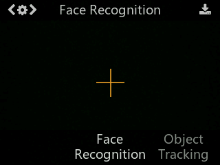
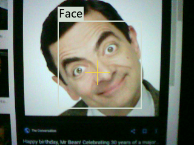
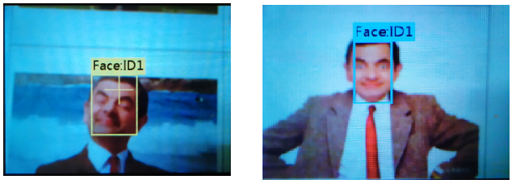
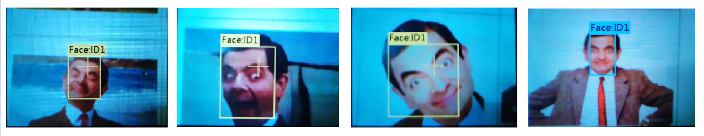
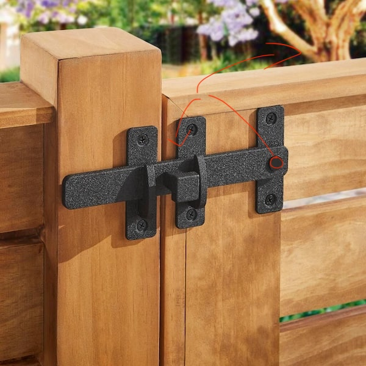

# Facial Recognition

This function can detect any face contour, recognize and track the learned face.

## Video Tutorial



---

## Text Tutorial


### Library
Before continuing, ensure that you have the [CircuitPyHuskyLens.py](circuitPyHuskyLib.py) file on your lib folder. 

## Recognize one face
The default setting is to learn and recognize a single face. Dial the function button to the left until the word "Face recognition" is displayed at the top of the screen.



## Learning and Detection
--- 
### 1. Face Detection Simple Classification:
Point the HuskyLens at any faces. When a face is detected, it will be automatically selected by a white frame with words "Face" on the screen.



At this point, you have 2 options. 
1. Selfie on computer screen: you may take a selfie of yourself, then train off of this image, rather than a live view. note, The husky lens is less accurate when viewing off a computer screen, due to pixel lighting complexities. 
2. train on your face using a partner + using the on RGB LED above the husky lens camera. 
3. Use your computer's camera to view the husky lens while training. 
- The RGB LED indicator is used to indicate the status of the face recognition function. Its colors are defined as:
    - Blue:	Detected a face, but not learned
    - Yellow:	Learning the new face
    - Green:	Recognized a learned face

### 2. Face Learning: Single Angle:
Point the “+” symbol at a face, short press the "learning button" to learn the face. If the same face is detected by HuskyLens, a blue frame with words "Face: ID1" will be displayed on the screen，which indicates that HuskyLens has learned the face and can recognize it now.




#### Learning Frame
In each setting/mode, the color definitions of the frame (colour box at the edges of the huskylens screen OR the square frame that surrounds the object of interest) and the symbol "+" in the center of the screen are all the same, which helps you know the current status of HuskyLens.

Color:	Status
* Puling orange to yellow, then yellow to orange: Have not learned the object yet but ready to learn
* Yellow: 	Learning the new object
* Blue: 	Have learned the object and recognized it

### 3. Face Learning: Multiple Angles
Before this step, take multiple selfies of your face from various angles. 


In the previous example, the HuskyLens only learned one plane (one-dimensional) of the face after the above operation, while a human face is three-dimensional. If the angle of the face has been changed (ie, you rotate in front of the camera), the HuskyLens may not recognize it. **So you need to let HuskyLens learn a face from its different angles.**

Before the HuskyLens learns a new thing, you must first forget the previous thing(s).

#### Forget the Learned Face:
If there is no “+” symbol in the center of the screen, it means that the HuskyLens has already learned the face in the current function. If you want to recognize another face, or re-enter face information, you need to delete the current face information.

When HuskyLens is in the face recognition mode, short press the "learning button", the screen will display "click again to forget". Before the countdown ends, short press the "learning button" again to delete the learned face information, then the yellow "+" symbol is displayed. Now you can let HuskyLens learn a new face.

#### Learn your face from multiple angles

Press and hold down the "learning button". Keep holding down the “learning button”, point HuskyLens' "+" symbol at different angles of the face. (rotate your face in front of the husky lens)

During this process, a yellow frame with words "Face: ID1" will be displayed on the screen, which indicates HuskyLens is learning the face. Please point the yellow frame at different angles of the same person's face, such as front face and side face (or multiple photos of the same person), to enter all angles of this person's face.

Then you can release the "learning button" to finish the learning. When Huskylens detected the learned face, a blue frame with words "Face: ID1" will be displayed, now HuskyLens can recognize the face from different angles.



If there is no “+” symbol in the center of the screen, it means that the HuskyLens has already learned the face in the current position/mode, now HuskyLens is detecting it. If you want to let HuskyLens learn a new face, you have to make it forget the learned face first.

#### Confirmation 
The learned face information will be automatically saved. When HuskyLens detects the learned face, this face will be selected by a blue frame and identified as face: ID1. The size of the frame will change with the size of the face, and the face will be tracked automatically.

--- 

# Sample Program

The following program will print out all known data of a recognized face to your serial console. Test this on your microcontroller after you have trained your face from multiple angles

```python
import board
import time
from circuitPyHuskyLib import HuskyLensLibrary

hl = HuskyLensLibrary('I2C', SDA=board.SDA, SCL=board.SCL)
hl.algorithm("ALGORITHM_FACE_RECOGNITION") # Redirect to Face Recognition Function

while True:
    results = hl.learnedBlocks() # Only get learned results (recognized face)
    
    if results: # if result not empty
        for i in results:
            if i.ID == 0:
            # print out all current data known about the block
                print("Learned:", i.learned)
                print("X:", i.x)
                print("Y:", i.y)
                print("Width:", i.width)
                print("Height:", i.height)

    time.sleep(0.5)
```

There's a new data type here, called a list. the results object will return a "list" of multiple recognized objects. Lists in python are base 0. For example:

```python
winners_list = ["1st", "2nd", "3rd"]

print(winners_list[0])
print(winners_list[2])
```

- this list has 3 indexes. 0,1,2 respectively
- you can access specific index data by using `list_name[index#]`
- the first print statement would return `1st`, as we accessed index 0 of our list.
- the second print statement would return `3rd` as we accessed index 2 of our list. 

---

## Challenge: Facial Recognition Door Lock Level 0

Create a simple door lock that will open if the husky lens recognizes the face, and closes if there is no face recognized. We're going to "proxy" our door. Imagine you have a simple bar lock, like so. 



When the servo is down, the door is locked. When the servo is up, the door is unlocked. Imagine the positional servo controls the locking/unlocking rotation of the bar lock. 

**You will need:**
- Husky Lens
- Positional Servo, with a simple lego, "arm", attached

1. Initialize your husky lens + Servo
2. When your husky lens detects a recognized face, open the positional servo
3. Otherwise, close the servo. 

## Challenge: Facial Recognition Door Lock Level 1

Rather than simply having the door open/close if the face is recognized, let's have a user "interact" with the door in order for it to decide to open. We'll use channel 5 on our RC reciever to modulate this. Assume that flicking channel 5 up (our 2 way switch) will cause the user to want to unlock the door. If the face is recognized, the door should open. 

**You will need:**
- Husky Lens
- Positional Servo, with a simple lego, "arm", attached
- rc Controller

1. Read sensors (RC channel 5 & husky lens)
2. if rc channel 5 is 1, user is requesting an open
    - if the face is recognized,
        - open the positional servo
        - print an access granted greeting. 
    - if the face is not recognized,
        - close the positional servo
        - print an unauthorized access greeting. 
3. If rc channel is 0, close the positional servo
4. have a small 0.02sec sleep at the end of the loop
