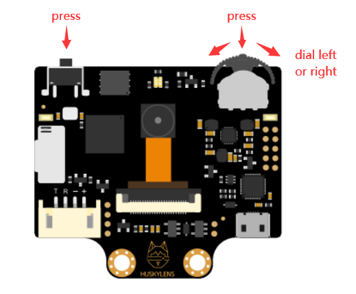
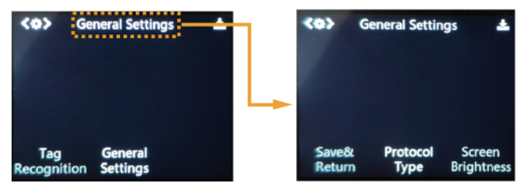
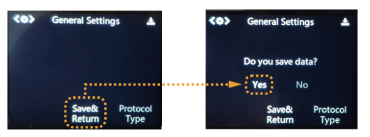

# Meet The Husky Lens

*Note: much of this tutorial is taken from the DF Robot wiki [here](https://wiki.dfrobot.com/HUSKYLENS_V1.0_SKU_SEN0305_SEN0336)*

HuskyLens is an easy-to-use AI machine vision sensor with 7 built-in functions: face recognition, object tracking, object recognition, line tracking, color recognition, tag recognition and object classification.


* 4pin Connector in I2C Mode
* 1	T:	SDA	Serial data line
* 2	R:	SCL	Serial clock line
* 3	-:	GND	Negative (0V)
* 4	+:	VCC	Positive (3.3~5.0V)

## Buttons
There are two buttons on the HuskyLens, the function button and the learning button. The basic operations of these two buttons are shown as follows:



1. Dial the "function button" to left or right to switch different functions.
2. Short press the "Learning button" to learn the specified object; long press the "Learning button" to continuously learn the specified object from different angles and distances; if HuskyLens has learned the object before, short press the "Learn button" to make it forget.
3. Long press the "function button" to enter into the second-level menu(parameter setting) in the current function. Dial left, right or short press the "function button" to set related parameters.

## Basic Operation
Select the general settings: Dial the function button right until the words “General Settings” is displayed at the top of the screen, then select it.

Enter the general setting mode: Short press the function button to enter it.



Select and adjust a parameter. Let's adust "Protocol Type": Dial the function button left or right to select the "i2c" protocol, Dial the function button left or right to adjust the parameter. Then short press the function button again to confirm the parameter.



Save the settings: After adjusting the protocol type parameter, dial the function button left to select "Save & Return", then short press the function button. A message “Do you save data?” will appear. The default selection is "Yes". At this time, short press the function button to save and exit.

## Coordinate System
When HuskyLens is detecting a object, the target will be automatically selected by a color frame on the screen. The coordinates of the color frame position x and y are assigned according to the following coordinate system. After getting the coordinates from the I2C port, you can know the position of the object.

Format:（x,y）


---

# Simple Program

We'll now write a simple program to keep track of how many faces the husky lens detects in the current frame. Use the image below as a test image


### Wiring 

Connect the husky lens to your metro m4 express board as follows:

* 4pin Connector in I2C Mode
* 1	T:	SDA	Serial data line
* 2	R:	SCL	Serial clock line
* 3	-:	GND	Negative (0V)
* 4	+:	VCC	Positive (3.3~5.0V)

Then, run the following code. when you point the huskylens at the image, what is printed on your serial port? What about a different image? How reliable is the huskylens?

```python
import board
import time
from circuitPyHuskyLib import HuskyLensLibrary

hl = HuskyLensLibrary('I2C', TX=board.SDA, RX=board.SCL)
hl.algorithm("ALGORITHM_FACE_RECOGNITION") # Redirect to Face Recognition Function


while True:
    results = hl.blocks() # Get All type=BLOCK results (any valid "face" results)
    
    if results: # if result not empty
        print("Detected face count:", {len(results)}) #count how many faces were returned
    else:
        print("no faces detected")
        
    pixel.show() # turn on NeoPixel
    time.sleep(0.5)

```

#### Return Data Format
- the "results" variable is a special type of variable, called an object. Similar to our rc object, it has data associated with it. So rather than simply being a single value, it is an object with multiple values associated with it. 
    - for example, an object "Jip" might have the following data associated with it:
> class Human:
> name: (`str`) name of the human
> height: (`int`) height of the human, in cm
> weight: (`float`) weight of the human, in kg
> is_adult: (`bool`) Is the person over 18? if so, returns True

- Jip may have the following data associated:

> class Human:
> name: `'Jip'`
> height: `155`
> weight: `54.9`
> is_adult: `False`

- If we were to do something like `print(Jip.height)` it would return `155`
- If we were to do: `print(Jip.is_adult)` it would return `False`
- we can use the `object.property` "dot" notation to get individual properties from

--- 
- All Data returned from the husky lens corresponds to  `block` information for all algorithms. This directly reflect the blocks/frames you see on the HuskyLens UI (the screen on the husky lens)
- This block object lets us pass this information into our microcontroller. The Block object has several properties associated with it:

> class Block:
> - x: (`int`) x coordinate of the center of the block.
> - y: (`int`) y coordinate of the center of the block.
> - width: (`int`) width of the block, in pixels
> - height: (`int`) height of the block, in pixels
> - ID: (`int`) object ID (if not learned, ID is 0)
> - learned: (`bool`) Is the object learned? (If object learned, learned is True)


