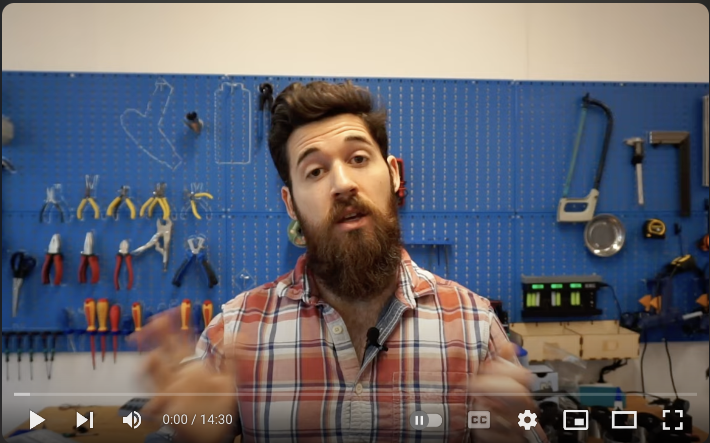

# 4-Pin Buttons

Lets talk about how to wire and program 4-pin Buttons

## Video Tutorial
Click the link below to watch a video on how to program a 4-pin button. 

## Text Tutorial

See [this link](https://sites.google.com/view/circuitpython/tutorials/button-and-led) for how to program a 4-Pin button. 

Let's get more practice initializing pins for different components on our board. Its best to get the practice of initializing hardware under your belt, as it's something we'll be doing A LOT. To do get more practice, lets make a more complex circuit. 

