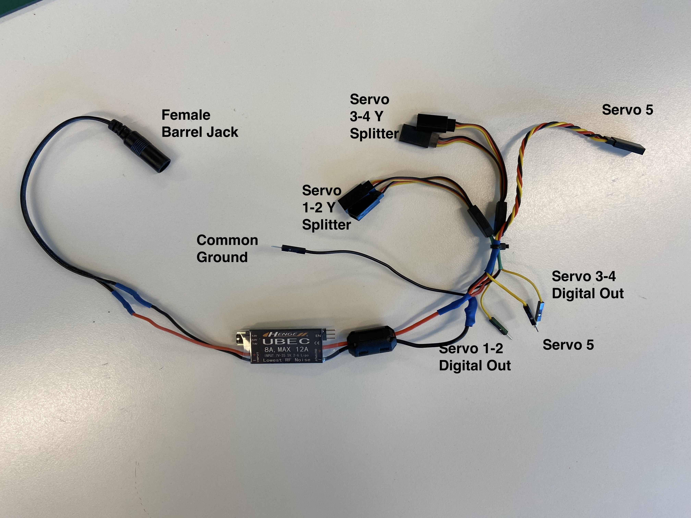

# Universal Battery Elimination Circuit (UBEC)

In this tutorial, we'll learn how to power a microcontroller and multiple servo motors using a Universal Battery Elimination Circuit (UBEC) to prevent *brownouts*. This setup ensures that both components receive stable power and operate efficiently.

## What is a Brownout?

A brownout occurs when the voltage supply drops below the minimum required operating voltage, causing the microcontroller to reset or behave unpredictably. You know you've browned out when your serial port outputs a `Microcontroller rebooted in safe mode due to power limit issues`. This typically happens when the current demand exceeds the supply capabilities, *which can occur if too many servos are connected directly to the microcontroller's power pins*. This is why we need an alternative power source if we are using too many servos, or our servos are too power hungry. 

## What is a UBEC?

`Universal Battery Elimination Circuits (UBECs)` are electronic devices designed to provide a stable voltage output from a higher voltage power source. They are frequently used in radio-controlled vehicles and aircraft to power receivers, servos, and other onboard electronics.

Using two separate power sources ensures that the high current demand of the servo motors does not affect the microcontroller's power stability. The UBEC provides a consistent voltage to the servos, while a separate power source supplies the microcontroller.

## Why Avoid Powering Multiple Servo Motors Directly from the Microcontroller?

Microcontrollers, like the Metro M0 Express, have limited current capabilities. When you connect more than two servo motors directly to the microcontroller, you risk causing a **brownout**. 
* This is because the servo's we use have `stall currents` of upwards of 2400mA peak, with about 300-500mA at idle on 5v.
* The microcontroller can output x2 different mA outputs:
    * when on Computer USB power: `~500mA` Peak
    * when on DC power: `~800mA` Peak
* As you can see, we will quickly hit our power limits if we start to stall out any of our servo motors. (when motors stall, they require more power as more load is applied to them. A *stalled* motor happens when it's torque requirements overpower it's current draw requirements)

---

## Level Switching Jumper (5V, 6V, 7.4V)
Your UBEC can output 5V, 6V, or 7.4V to the servo depending on where you place the jumper switch. 
    - By bridging two pins with the jumper, you set the UBEC to the desired voltage output. 
    - For most servo motors *in Mars Rovers* setting the UBEC to 5V or 6V is ideal. In *Elevation Engineering* we'll use 7.4V. 

In this example, we have the jumper switch set to 5V

And in this example, we have the jumper switch set to 7.4V

---

# Wiring Diagram 9V 6xAA Battery Pack (Mars Rovers)

### Explanation:

- **9V Barrel Jack Connector:** Connect this to your primary power source, our 6x AA battery pack. 
- **Common GND:** Connect the ground of both the microcontroller circuit and the servo motor circuit here.
    - Connect this to your micro controller GND
    - A common ground is a shared reference point in an electrical circuit. 
    - By connecting the grounds of both power sources together (common ground), you ensure a stable reference voltage across the entire circuit. 
    - This is crucial for preventing erratic behavior and ensuring proper communication between components. If we didn't have a common ground, we would have no circuit for our servo's to recieve signals from. 
- **Servo Shrouds (1, 2, 3):** These connect to your servo motors.
- **Servo Data Out (D. Out):** These connect to the data pins of your servos.
- **Level Switch Jumper:** Use this to select the voltage output of the UBEC. Use 6V for Mars Rovers. 

---

# Wiring Diagram 12V Battery Pack (Elevation Engineering)

### Explanation:

- **12V Ring Terminals:** Connect this to your Motor controller 12V source. We'll bridge this to power both our motor controller from 12V *and* our DC motors from 12V. 
- **Common GND:** Connect the ground of both the microcontroller circuit and the servo motor circuit here.
    - Connect this to your micro controller GND
    - A common ground is a shared reference point in an electrical circuit. 
    - By connecting the grounds of both power sources together (common ground), you ensure a stable reference voltage across the entire circuit. 
    - This is crucial for preventing erratic behavior and ensuring proper communication between components. If we didn't have a common ground, we would have no circuit for our servo's to recieve signals from. 
- **Servo Shrouds (1, 2, 3, 4):** These connect to your servo motors.
- **Servo Data Out (D. Out):** These connect to the data pins of your servos.
- **Level Switch Jumper:** Use this to select the voltage output of the UBEC. Use 6V for Mars Rovers. 

