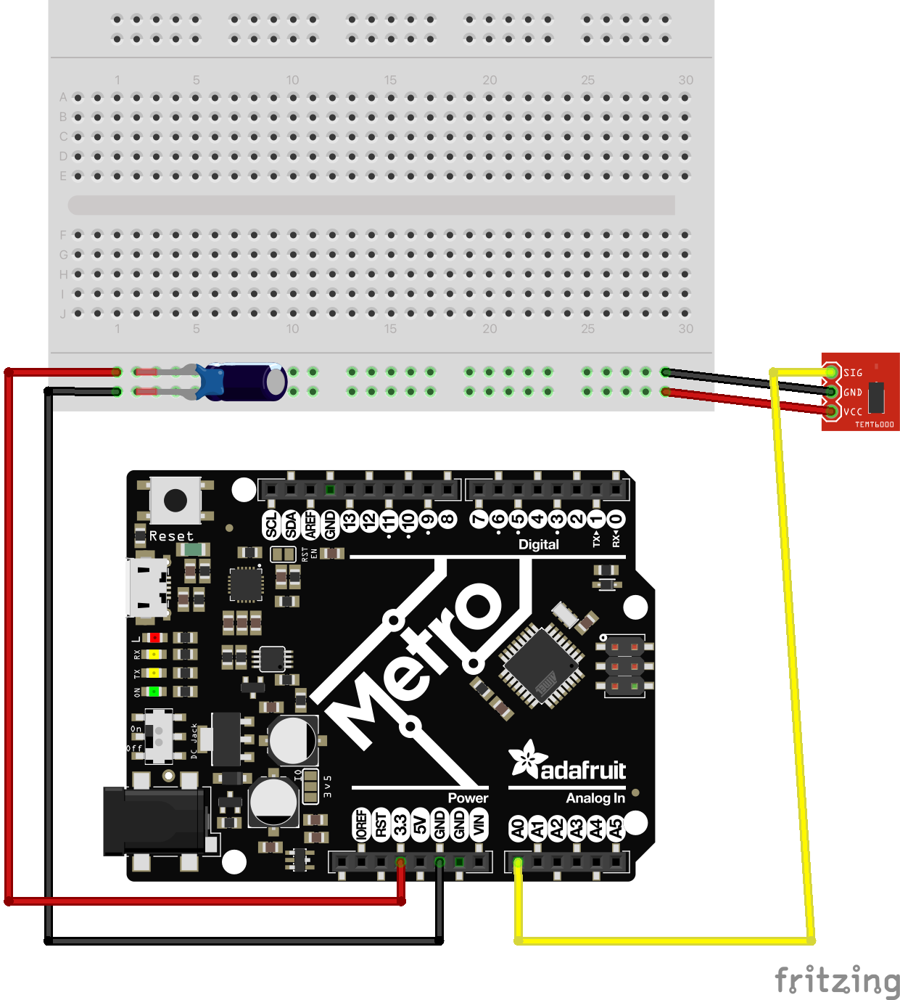

# Learning About Analog Sensors

By the end of this tutorial, you’ll understand the key differences between analog and digital signals, how to read analog inputs, and the benefits of abstraction in code. 

# Video Tutorial



***

# Text Tutorial

## Analog vs. Digital Signal

In a 3.3V system, digital signals are straightforward—they’re either 0V or 3.3V. Essentially, digital signals boil down to `True` (3.3V) or `False` (0V) states. 

Analog signals, on the other hand, return a range of values within that voltage spectrum. An analog sensor can output any voltage value between 0V and 3.3V. This variety allows us to measure more granular data from our environment. See the chart below for an example of a ranged vs discrete signal. 


[*instrumentiontools.com*](https://instrumentationtools.com/wp-content/uploads/2021/04/What-are-Analog-and-Digital-Signals.png)

- **Digital Signal:** Binary (0 or 1), 0V or 3.3V in a 3.3V system.
- **Analog Signal:** Continuously variable within a range (0V to 3.3V).

***

### Reading Analog Sensors in Circuit Python:

Analog input values are always 16-bit. This means that regardless of the reference voltage, the value will be in the range 0 to 65535. We're going to use a line sensor operating at 3.3V and our sumo battlefield to test our values.

---

## What is a Line Sensor?


A line sensor typically consists of two infrared LEDs: one for emitting (sending out) and one for receiving (getting back) the signal. The sensor measures the amount of light reflected back to it. 


- **White Surface:** More light is reflected back, resulting in a lower voltage value.
- **Black Surface:** More light is absorbed, resulting in a higher voltage value.

We’ll use this line sensor to prevent our rover from falling off an elevated sumo battlefield. The field is matte white, with a thin matte black band around the edge. When the sensor detects the black band, it should* stop the rover to prevent it from falling over the edge.


---

## Line Sensor Wiring Diagram
The wiring is similar to any other sensor, with a Signal, V, and GND line. Ensure you're passing through a 3.3V rail, and through both capacitors. 



---

## Three Levels of Code Abstraction
We'll explore three different codes to understand the concept of abstraction and 16 bit values better. We'll start with a low level of abstraction, 16 bit resolution, and then move up through the chain to make our code more understandable over time:

1. **Basic Analog Reading in 16-bit Resolution**
2. **Reading True 3.3 Voltage Values**
3. **Mapping Analog Readings for Usefulness**


### 1. Basic Analog Reading in 16-bit Resolution

This is the simplest way to read analog values. The code will output the raw 16-bit values (0 to 65535). This is a useful learning task, but trying to program anything in a range of 65536 values is a nightmare. 


```python

import time
import board
from analogio import AnalogIn

analog_in = AnalogIn(board.A0)

while True:
    print(analog_in.value)
    time.sleep(0.1)
```

Test your sensor 

---

### 2. Reading True Voltage Values

To help with abstracting away some of the complexity of a 65536 point scale, we'll create a function `get_voltage` to convert the 16-bit raw value into a voltage based on a 3.3V reference. This function will tell us exactly how many Volts our microcontroller is reading at any one time. 


```python

import time
import board
from analogio import AnalogIn

analog_in = AnalogIn(board.A1)

def get_voltage(pin):
    # Switch to 5V if necessary
    return (pin.value * 3.3) / 65536

while True:
    print(get_voltage(analog_in))
    time.sleep(0.1)

```
There may be a new concept for you here, the word `return`. 
- **Return Value:** The `return` statement is key—this function outputs the converted voltage value. A `return` value is the data that a function provides as a result of its execution. When a function completes its task, it can send back a value to the caller using the return statement. 
- For example:

```python

def move_forward():
    m1.throttle = 1.0
    m2.throttle = -0.97

def add_numbers(a, b):
    result = a + b
    return result

move_forward() # this works as expected
speed = move_forward() #this throws an error, as move_forward() has no return value! 

sum = add_numbers(3, 5)
print("The sum is:", sum)
```

- In the example above, `move_forward()` has no return value and can be called at any time without an assignment statement. 
- `add_numbers()` however, has a return value. This means we need to assign the function to a variable or arguement first, as we've done here with `sum`

---


### 3. Mapped Analog Readings for Usability

Programming with values from 0-65535 or 0-3.3 with ifinite numbers in betweem is not the most useful for programming. You're assessed on a 4 point scale in this class, could you imagine being assessed on a 65536 point scale? How would you meaninguflly differentiate improved performance from 65423 to 65424? 

Instead, we'll use abstraction to map our analog value to a more manageable range, like 0-100.


```python

import time
import board
from analogio import AnalogIn
from adafruit_simplemath import map_range

analog_in = AnalogIn(board.A1)
new_min = 0
new_max = 100

def read_analog(pin):
    # Maps our current 0-65535 range to 0-100
    return map_range(pin.value, 0, 65535, new_min, new_max)
    # map_range(value, from_min, from_max, to_min, to_max)


while True:
    print(read_analog(analog_in))
    time.sleep(0.1)

```
- **Mapping Function:** `map_range` simplifies our use of sensor data by mapping raw analog values to a more intuitive range. It takes 5 arguments in total: 
    - value: The number to map from the original range to the new range.
    - from_min and from_max: The minimum and maximum values of the original range.
    - to_min and to_max: The minimum and maximum values of the new range.\
- This level abstracts complexity, thus making the code more understandable. The `map_range` function is called to map the 0-65535 ADC value to a new specified range (new_min to new_max), which simplifies the interpretation of the raw sensor data into a more understandable range (for example, percentage or voltage).

We can abstract even further by transforming our `float` decimal return to an `int` integer number return. 

```python

def mapped_voltage(pin):
    # Maps our current 0-65535 range to 0-100
    mapped_value = map_range(pin.value, 0, 65535, new_min, new_max)
    return floor(mapped_value)
```

- `floor()` is a method from the `math` library that allows us to round down all values returned. 
- Alternatively, you could also use `round()` instead of `floor()` to round the numbers. 

From this point forward, I would suggest that you use the mapped value outputs for programming your analog sensor, it will make your life much simpler by using some level of abstraction in your code. 
