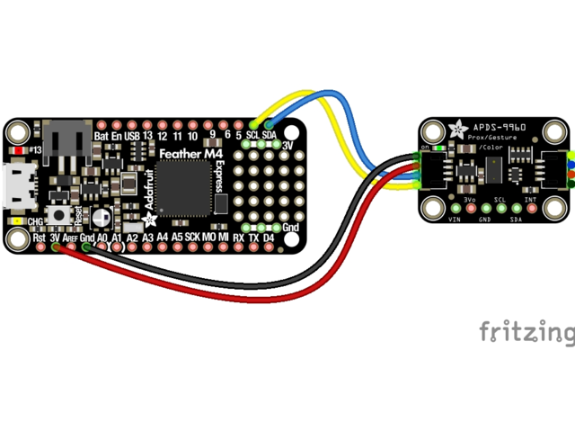

# APDS-9960 Color Sensor Tutorial

In this tutorial, you'll learn how to use the APDS-9960 sensor in color mode. This sensor can detect red, green, blue, and clear light. You'll learn how to wire the sensor, understand how it works, see a code example, and complete some challenges to test your understanding.

# Video Tutorial



***

# Text Tutorial



To wire the APDS-9960 sensor using StemmaQT, follow these steps:

1. **Connect the Blue Wire (Data):** Connect the blue wire to the data (SDA) pin on your microcontroller board.
2. **Connect the Yellow Wire (Clock):** Connect the yellow wire to the clock (SCL) pin on your microcontroller board.
3. **Power and Ground:**
   - Connect the red wire to the 3.3V or 5V power pin.
   - Connect the black wire to the ground (GND) pin.

*** 


## How the Color Sensor Works

The APDS-9960 sensor has an integrated color light sensor that can measure the intensity of red, green, blue, and clear light.

- **Red, Green, Blue (RGB):** The sensor has photodiodes that can detect red, green, and blue light. By measuring the intensity of each color, it can determine the color of an object.
- **Clear Light (C):** It also detects clear (ambient) light, which can help determine overall brightness.

The sensor connects on a new type of communication protocol, i2c. 

### I2C Communication

I2C (Inter-Integrated Circuit) is a communication protocol commonly used in microcontrollers and sensors to facilitate communication between devices. It allows multiple "slave" devices to communicate with one or more "master" controllers using only two wires, making it a simple and efficient method for data transfer. Effectively we could connect 20+ sensors to these single 2 pins and be able to interact with them all, rather than needing 20 individual digital/analog pins. 

#### Key Components of I2C:

1. **SCL (Serial Clock Line):**
   - SCL is the clock line that is controlled by the master device.
   - It synchronizes the data transfer between the master and slave devices.
   - Both the master and slave devices rely on SCL to know when to read or write data.

2. **SDA (Serial Data Line):**
   - SDA is the data line used to transfer data between devices.
   - It is a bidirectional line, meaning it can be used by both master and slave devices to send and receive data.
   - Data on the SDA line is transferred in synchronization with the clock pulses on the SCL line.

#### How I2C Works:

- **Addressing:** Each device on the I2C bus has a unique address. The master sends an address to indicate which slave it wants to communicate with. This is typically denoted as [0x0a] or [0x20], etc, with each binary being a different device. 
- **Data Transfer:** Data is transferred in bytes. The master controls the clock, while data is sent over the SDA line in synchronization with the clock pulses.


## Code Example

Here's a basic code example to get started with the APDS-9960 sensor in color mode:
Ensure you have the [adafruit_adps9960](../../../circuit_python_libraries/lib/adafruit_apds9960/) library on your `CIRCUITPY` Lib folder. 

```python

import board
import busio
import time
import adafruit_apds9960.apds9960

# Set up I2C connection
i2c = busio.I2C(board.SCL, board.SDA)
sensor = adafruit_apds9960.apds9960.APDS9960(i2c)

# Enable color sensing
sensor.enable_color = True

while True:
    r, g, b, c = sensor.color_data
    print("Red:", r, "Green:", g , "Blue:", b, "Clear:", c)
    time.sleep(1)

```

***

## Challenges

### Challenge 1: Light Up RGB LEDs

Wire up constantly-on Red, Green, and Blue LEDs to test the color detection capabilities of the APDS-9960. If you've forgotten how to wire LEDs in constant power, [refer back to this tutorial](../breadboard_basics/breadboard_basics.md). Try changing the ambient light conditions and see how the sensor readings change.

### Challenge 2: Create a Color Detector

Create a function that takes the red, green, and blue values as inputs and returns a string representing the detected color (e.g., "Red", "Green", "Blue", "Unknown").
- Use the intensity of each color component to determine which color is predominant.
- Consider ranges for each color to account for variations in sensor readings.

<details>
<summary>Click to reveal a hint for Challenge 3</summary>
You can use a simple threshold to decide if a color is dominant, e.g., if red > 100, green < 50, blue < 50, it's likely red. Experiment with different thresholds based on your readings.
</details>