# Simple Circuits

Let's practice making some simple circuits on a breadbaord to learn more about electricity. We'll use no code at this point, and for some of you this may be a refresher. 

## Voltage, Current, & Resistance
[Taken from J. Froelich's Excellent website on physical computing](https://makeabilitylab.github.io/physcomp/electronics/electricity-basics.html)
So, what is voltage, current, and resistance?

In short, voltage “pushes” electrons through conductive material (e.g., a wire). The amount of electron flow is called current (measured in amps). Some materials are better at conducting current than others. Resistors are specially formulated to resist the flow of electrons (the resistance is measured in ohms).

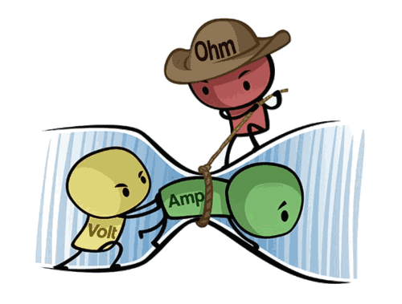
Figure. A humorous but helpful depiction of the relationship between voltage (measured in volts), current (measured in amps), and resistance (measured in ohms). The yellow “volt” character is trying to push the green “amp” character through a tube (i.e., a wire) but the red “ohm” character is impeding this by restricting the size of the tube (by tightening a rope, reducing its girth). The image source is unknown but there are many examples and alternatives online.

## What is Current? 
[Taken from J. Froelich's Excellent website on physical computing](https://makeabilitylab.github.io/physcomp/electronics/electricity-basics.html)

Current is the flow of charged particles through a conductor. In digital circuits, these charged particles are electrons (negatively charged particles) propelled by an electromotive force (voltage) to move from “high pressure” to “low pressure” in a circuit.

Electric current is similar to water current moving through a pipe. Just like with water where we can guide water flow through various pipe configurations and harness its kinetic energy (e.g., by spinning a turbine), so too can we use wires to guide the flow of electrons and use it to power lamps, turn motors, etc.

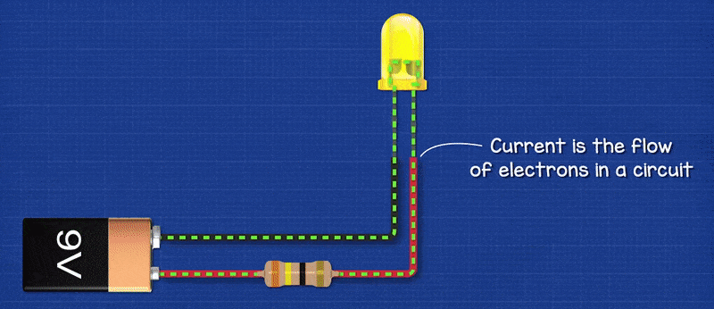
Figure. Current is the flow of charged particles—in this case, electrons—through a conductor. In the animation above, we are illustrating “electron flow” as a dotted green line, which flows from the negative terminal of the 9V battery, through an LED and resistor, and then back to the 9V battery to its positive terminal. Note that this is actually opposite from conventional current flow, but we’ll get to that below. Animation from The Engineering Mindset.

## Challenges

With a rudamentary understanding of voltage, current (and it's flow), and resistance, let's build some simple electronic circuits to put our knowledge to the test. Follow through each of these tutorials to get some practical experience playing with different electrical components. 

## Challenge 1: Simple LED Circuit

### Providing power
We'll use a "microcontroller", the MetroM0 Express, in this course. Normally we program this board, but we'll use it to provide our power for today. Using x2 male-male jumper wires, Wire the 3V power to a rail on your breadboard, and do the same for your Ground. 3V is 3volts of power, and GND is your ground, or negative rail. 

The important thing here to note is that you're starting to create a **power rail using 3.3V**. Eventually we'll make the top row our 5V power rail. 

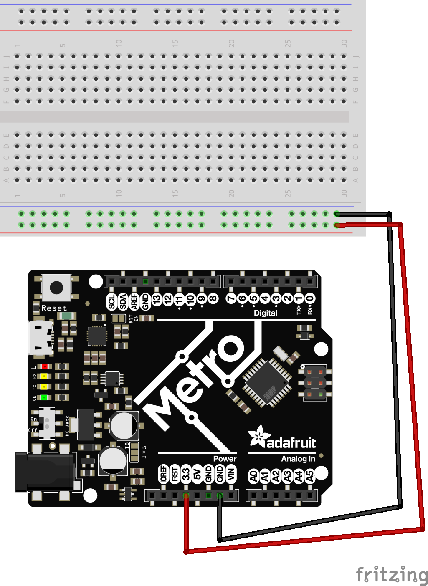

Turn OFF the DC power switch (left side of the metro "on/off"), and connect your 9V (6xAA) battery pack. 

### LED Wiring (front load resistor)
Let's make an LED light up. Follow the below digram using a 220ohm resistor. Note, your LED only allows electricity to flow through one way. Take a look at this diagram to figure out the +/- (anode/cathode) side of an led. 

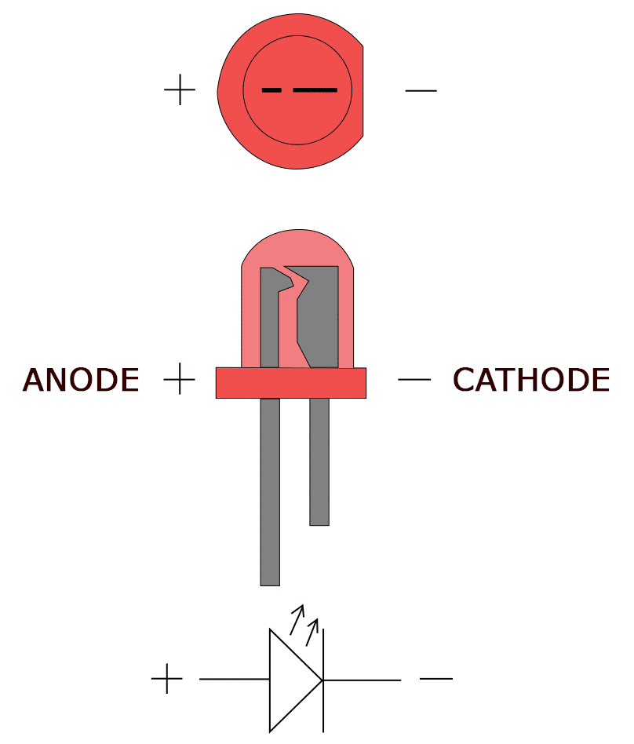

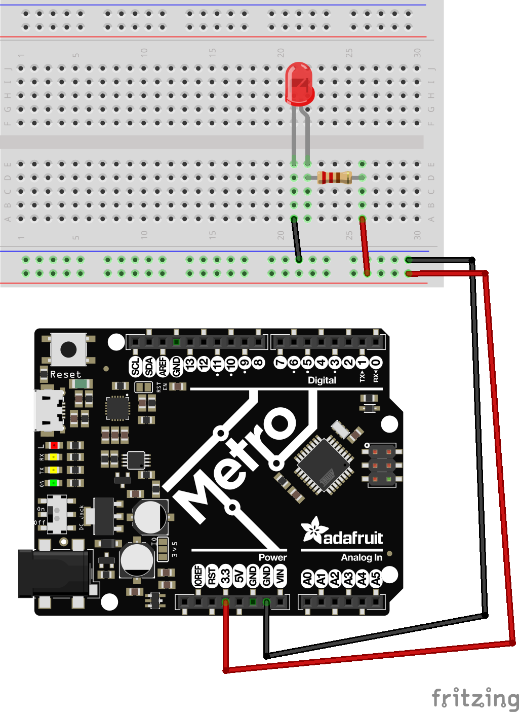
* How is electricity flowing in this circuit? 

### LED Wiring (rear load resistor)
You noticed on the last schematic we wired our resistor in front of the LED on the V lead. Now, lets wire this on the GND line instead. Do you observe any differences? What does this tell you about resistors and their placement in a circuit? 
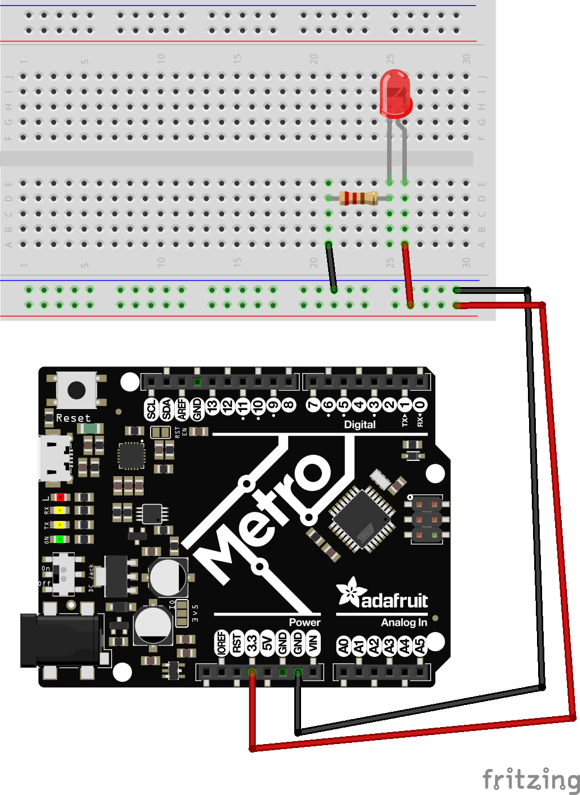

### 2LEDs in series
Let's wire up x2 LEDs in "series". We'll add another LED to our circuit, but this time *in line* with the other LED, or in a "series" of LEDs. Watch what happens to the brightness of this LED. 

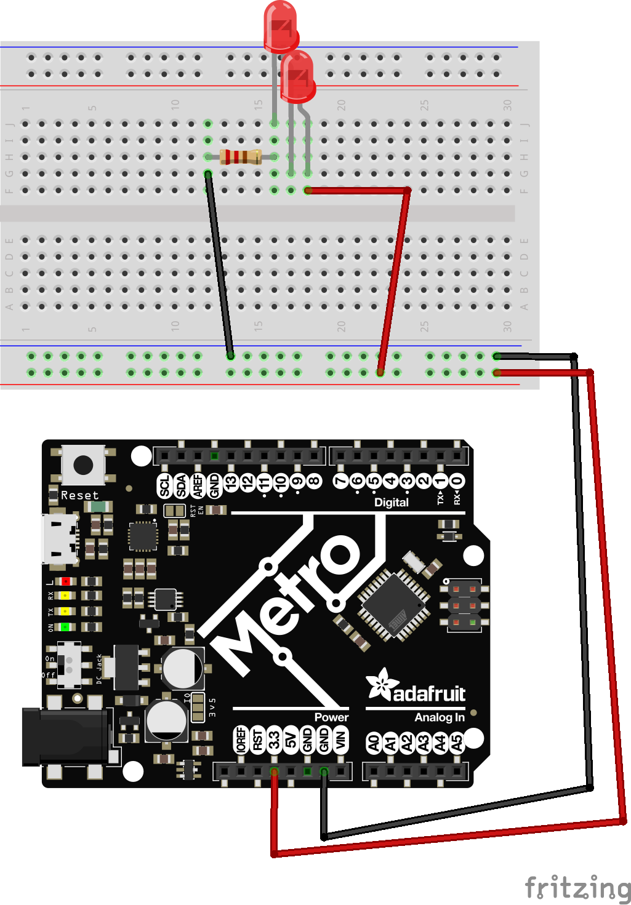

* In this circuit, To not get too technical, our Voltage drops by 1/2 between the 2 components, but our total current stays the same.
* Our output voltage is 1/2 as bright, but our battery lasts the same as if only a single, brighter LED was being lit. 

### 2LEDs in parallel
Lets now change this circuit into a parallel circuit. Observe what happens to our LEDs this time. How has the brightness been changed? 

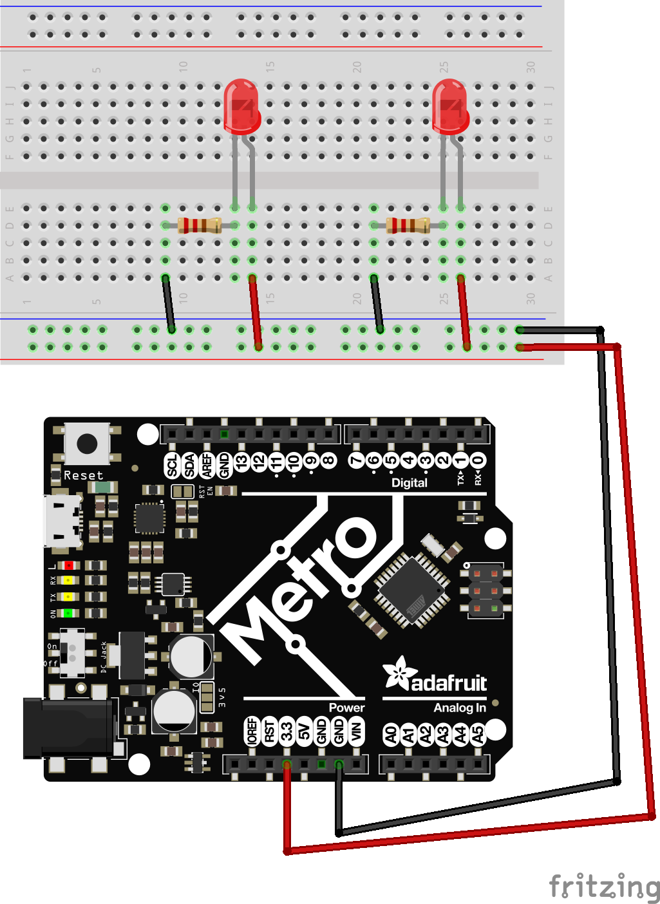

* Now, our voltage to both LEDs is the same on each LED, 3.3V. So we get the same brightness output
* however, our current draw is now doubled. This means our battery would drain twice as fast. 

### 4-Pin Button

Let's try lighting up an LED with some interactivity now. We'll attach a button to our circuit. A button has x2 parallel lines running under it, and when you push the button, it attaches all x4 leads together. Take a look at the figure below.

When you press your button, you should notice your LED light up. 

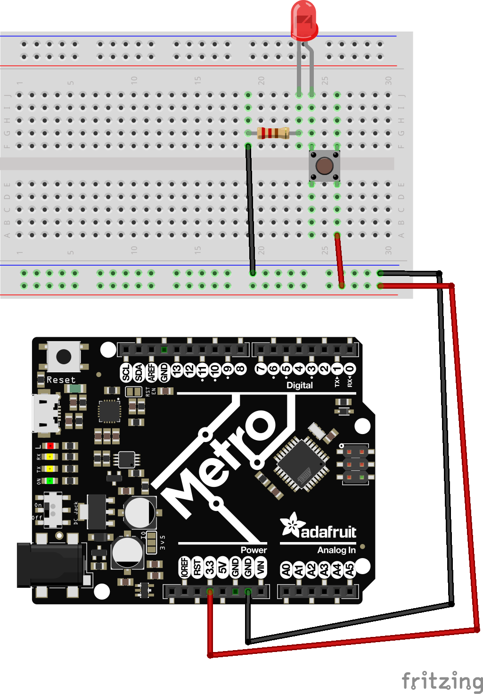

### Potentiometer Dimmer Light
LEDs can also have dimmers applied to them to adjust their brightness. We've been using a 220ohm resistor up to this point, but a potentiometer is a "variable" resistor from 0ohm > 10,000ohm, depending on where the wiper is spun to. 

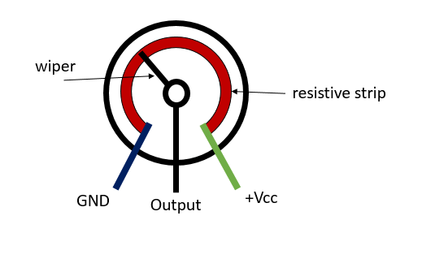

Let's wire up a potentiometer. There are x3 pins on a potentiometer (or "pot" for short), but for this we'll only use 2. 

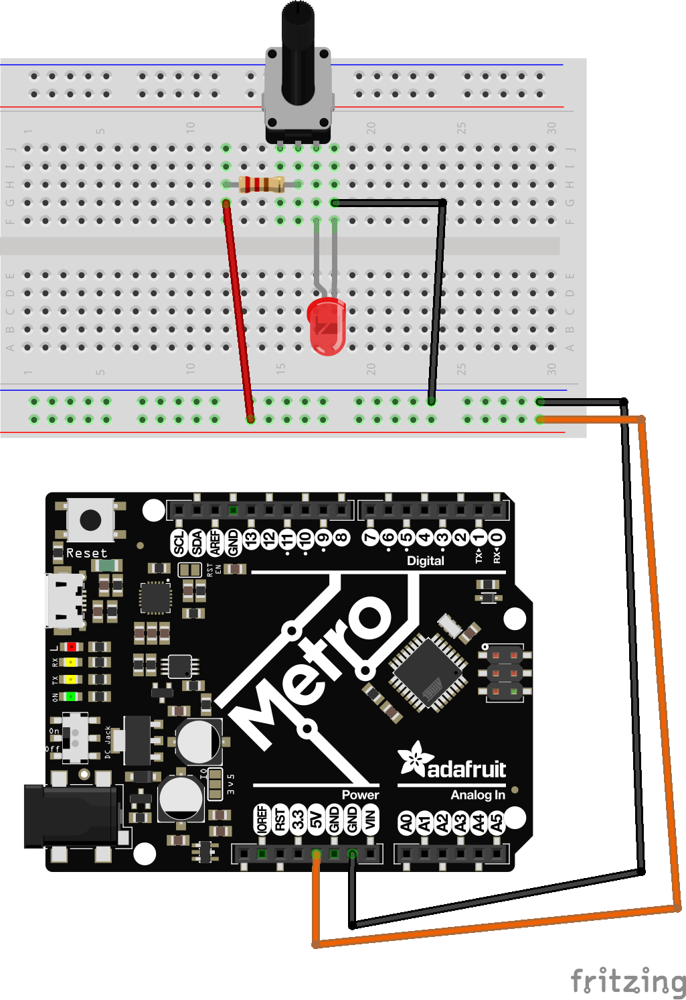

When you spin your pot, you'll notice your LED get brighter and darker

## Circuit Fun
With all the main circuits for today done, let's have some fun and practice making your own circuits with these different combinations. How can you combine these to make something unique? 