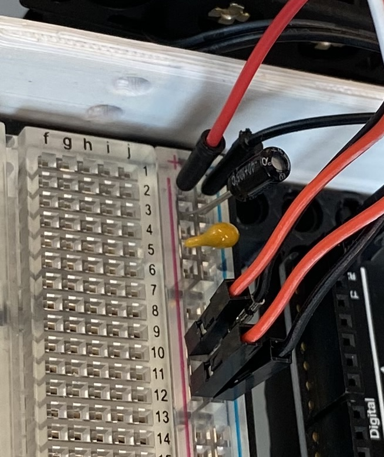

# Intro to Capacitors
[*original tutorial modified from V Ryan @ Technology Student.com*](https://technologystudent.com/elec1/capac1.htm)

Capacitors are components that store electrical charge. They are used in various applications, such as smoothing currents in circuits or preventing false triggering of other components. When power is supplied to a circuit that includes a capacitor, the capacitor charges up. When the power is turned off, the capacitor slowly discharges its electrical charge.

Capacitors can also help reduce electrical noise, especially in circuits with sensors, improving accuracy and stability. We'll use two types of capacitors in our projects:
* 10uF Capacitor
* 0.22uF Ceramic Capacitor

## Reducing Noise
Imagine a robotics project where you have a microcontroller connected to various sensors and motors. The microcontroller operates at a stable voltage but is sensitive to noise. Here's how both capacitors can help:

* 10uF Electrolytic Capacitor: Placed close to the power supply input to smooth out the ripples and voltage fluctuations, ensuring a steady DC voltage for the whole circuit.
* 0.22uF Ceramic Capacitor: Placed near the microcontroller's power pins to filter out high-frequency noise, preventing this noise from interfering with the microcontroller's operation and sensor readings.

## How a *non-ceramic* Capacitor works
Non-ceramic capacitors, such as electrolytic capacitors, have polarized leads. One lead is positive (anode), and the other is negative (cathode). These capacitors store electrical energy by accumulating negative charge on one plate and positive charge on the other when connected to a voltage source.

### Charging

When the capacitor is connected to a voltage source, electrons accumulate on the negative plate, repelling electrons from the positive plate, which are pulled towards the positive terminal of the voltage source. As more electrons accumulate, the potential difference increases, eventually stopping when it matches the supply voltage.

### Discharging

When the voltage source is removed, the stored charge on the plates is released, causing current to flow through the circuit. This process continues until the capacitor is fully discharged. If our power supply happens to dip voltage briefly, this capacitor will help keep all our components powered, helping to prevent a "brownout" (unstable power supply). 

## How a *ceramic* capacitor works

Ceramic capacitors are non-polarized components, meaning they can be connected in any direction. They store charge in the same way non-ceramic capacitors do, but they usually have smaller capacitance values and are used for different purposes.

## Anode & Cathode of Capacitors

* Look carefully at the photographs of the two types of capacitors.
* Remember what you learned about Resistors and LEDs. Do you notice similarities?

Identifying capacitor leads is crucial for correct installation.
### Electrolytic Capacitors
* Anode (Positive lead): Long lead
* Cathode (Negative lead): Short lead, often marked with a white "-" symbol

### Ceramic Capacitors
Ceramic capacitors are non-polar, meaning they do not have designated anode and cathode leads. They can be connected in any direction, similar to resistors.

## Wiring Capacitors in a Breadboard

* The closer your capacitors are to your power rail, the more noise they will filter out. 
* We want all signals to pass *through* the capacitors before heading back to the microcontroller, so they need to be first in line. 
* The wiring diagram is a bit muddy with the wires, so look at the real photo below as well. 
    * you'll notice that some ceramic capacitors are blue or orange. For the function of this course, they are the same. 

From now all, all circuits should use these x2 capacitors in this orientation. 