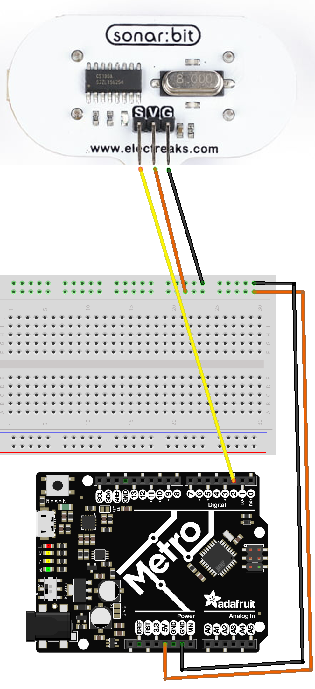

# Using a Distance Sensor in CircuitPython

This tutorial will teach you how to use a ping sensor (in our case, a "SonarBit" branded ping sensor) on a M4 board. 

# Video Tutorial



***

# Text Tutorial

## How Ultrasonic Sensors Work

Ultrasonic sensors operate by emitting ultrasonic sound waves at a frequency higher than the human ear can hear. The sensor then waits for the sound waves to bounce back (echo) from an object. It measures the time taken for the waves to return and uses this information to calculate the distance to the object. The formula used is:

```python
# Distance is defined as time/2 (emiting soundwaves + echo time) * speed of sound (34000 cm/s)
distance = floor((end_time - start_time) * 34000 / 2 / 1000000000)
```

This practical use-case is similar to how bats navigate in the dark.

Ultrasonic sensors like the SonarBit are designed to measure distances within a specific range accurately. In your case, the sensor measures distances accurately between 5 cm and 570 cm. When objects are closer than 5 cm, the sensor might give false readings due to several reasons:

### Sensor Blind Zone:
Ultrasonic sensors have a "blind zone" right in front of the sensor where they can't accurately measure distance. This is because the emitted ultrasonic wave and the reflected wave can overlap if the object is too close. This overlapping can confuse the sensor, leading to inaccurate readings.

### Minimal Time of Flight:
The principle of ultrasonic sensors relies on the time it takes for the sound wave to travel to the object and back (Time of Flight). When an object is very close, the time of flight is extremely short. The sensor might not be able to distinguish between the emitted pulse and the received echo, leading to false or zero readings.

### Signal Reflections:
At very close distances, the emitted ultrasonic waves can reflect off the object multiple times before returning to the sensor. These multiple reflections can cause the sensor to misinterpret the distance. For instance, the sensor might read the distance from a secondary reflection rather than the direct one.

## Example of False Readings:

When an object is placed 3 cm from the sensor (within the blind zone), the ultrasonic pulses sent out by the sensor might overlap with the pulses returning after hitting the object. Because of this overlap:

* The sensor might confuse the returning signal with noise.
* It might not detect the returning echo at all, thus resulting in no reading or a maximum range reading.
* It can also interpret multiple reflections as the main echo, showing an incorrect value.

## Wiring
An Ultrasonic Ping sensor has three key wires:

* Signal: The wire responsible for sending and receiving ultrasonic signals.
* Power: Provide 5V OR 3.3V power to the sensor.
* Ground: Provide a ground back to your microcontroller.



# Program Code
Start by copying the [sonarbit.py](sonarbit_example.py) code above onto your code.py file on your Microcontroller. 

```python
# Sonarbit_class Example
# SPDX-FileCopyrightText: 2024 Brogan Pratt
#
# SPDX-License-Identifier: MIT

import board
from sonarbit import Sonarbit
import time

distance_sensor = Sonarbit(board.D2)

prev_distance= 570  # Initial value

while True:
    distance = distance_sensor.get_distance(prev_distance)
    print("The object is: " + str(distance) +  " cm away")

    prev_distance = distance
    time.sleep(1)

```

## Code Explanation


### Libraries
Firstly, we import all revelant libraries. 

```python
import board
from sonarbit import Sonarbit
import time
```

* board: This library allows us to specify pin numbers for our microcontroller.
* sonarbit: This is a custom library for controlling the Sonarbit sensor.
* time: This library is used for adding delays in the code.

### Initializing the Sensor

Next, we need to initialize our distance sensor:

```python
distance_sensor = Sonarbit(board.D2)
prev_distance = 570  # Initial value
```

Here, we create an instance of the Sonarbit class and attach it to pin D2 of the microcontroller. We also initialize a variable prev_distance with a value of 570. This is the *maximum read distance* that our sensor is capable of sensing. 

### Main Loop

The main loop runs indefinitely to continually check and print the distance:

```python

while True:
    distance = distance_sensor.get_distance(prev_distance)
    print("The object is: " + str(distance) + " cm away")
    prev_distance = distance
    time.sleep(1)
```

* `get_distance(prev_distance)`: This method retrieves the current distance measured by the sensor. 
    * `prev_distance` is essential as an arguement. Sometimes, sensors might give out erratic readings due to noise or sudden changes in the environment. Providing a previous distance value can help the sensor's algorithm filter out such anomalies and provide more stable, consistent measurements.
    * This allows us to cancel out false positives or negatives. If an object gets <5cm away from the distance sensor, the sensor thinks the object is incredibly far away. 
    * why? If an object is touching the emitting or echo speaker on the sensor, The echo cannot hear the return value, and if it cannot hear the value, it assumes the object is too far away. 
* `print()`: Prints the measured distance in centimeters.
* `time.sleep(1)`: The loop pauses for 1 second to provide a delay between readings.
