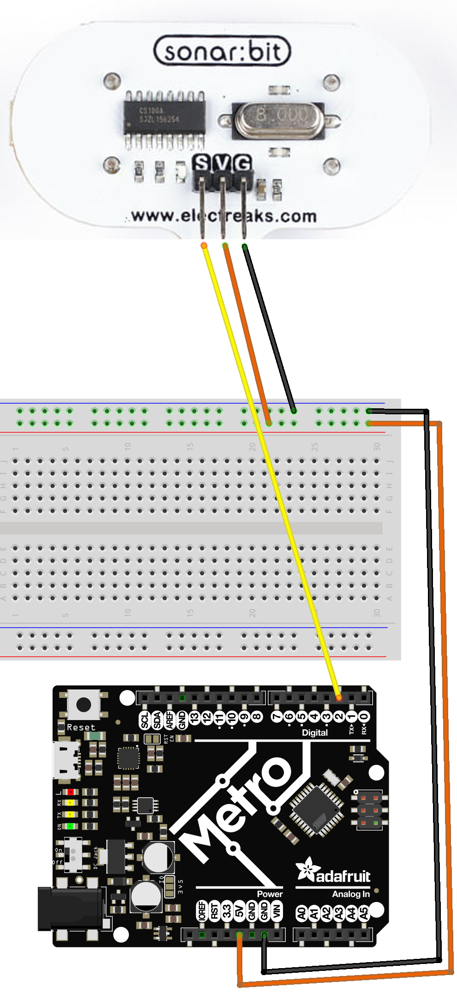

# Ping (Distance) Sensor

A distance/ping sensor sends out "pings" of ultrasonic sound and listens for their return, much like radar, to figure out the distance to an object.
Understanding the Ping Sensor

## Wiring
A Ping sensor has three key wires:

    Signal: The wire responsible for sending and receiving ultrasonic signals.
    Power: Provide 5V power to the sensor.
    Ground: Provide a ground back to your microcontroller.



## Setting Up the Code

### Ensuring Dependencies
 Ensure you have the following .py file added in your lib folder on your microcontroller, otherwise, you'll get an import module error.
* [Download the library py file](sonarbit.py)

## Python Code

In your code.py file, copy the following code

```
# Sonarbit_class Example
# SPDX-License-Identifier: MIT

import board
from sonarbit import Sonarbit
import time

pin = board.D2
distance_sensor = Sonarbit(pin)
prev_distance = 570  # Initial value

while True:
    distance = distance_sensor.get_distance(prev_distance)
    print("The object is " + str(distance) + " cm away")
    prev_distance = distance
    time.sleep(1)
```

Code Explanation

    Importing Libraries:

import board
from sonarbit import Sonarbit
import time

    board: Library for accessing microcontroller pins.
    sonarbit: Custom library we created for handling the Sonarbit sensor.
    time: Library for adding delays in the loop.

Initializing the Pin and Sensor:

pin = board.D2
distance_sensor = Sonarbit(pin)
prev_distance = 570  # Initial value

    pin: Assigns the digital pin D2 for the sensor.
    distance_sensor: Creates an instance of the Sonarbit class, passing in the pin.
    prev_distance: Sets an initial previous distance, crucial for preventing false high readings.

Continuous Distance Measurement Loop:

    while True:
        distance = distance_sensor.get_distance(prev_distance)
        print("The object is " + str(distance) + " cm away")
        prev_distance = distance
        time.sleep(1)

        while True: Creates an infinite loop to continuously measure distance.
        distance = distance_sensor.get_distance(prev_distance): Calls the get_distance method from the Sonarbit class, passing in the previous distance to get the current distance.
        print("The object is " + str(distance) + " cm away"): Prints the distance to the console.
        prev_distance = distance: Updates prev_distance with the current distance for the next iteration.
        time.sleep(1): Adds a delay of 1 second before the next measurement.

Running Your Code

    Copy sonarbit_class.py to the lib directory on your CircuitPython device.
    Copy sonarbit_class_example.py to the root directory of your CircuitPython device.
    Ensure your Ping sensor is connected to pin D2 on your microcontroller.
    Run the script on your device. It will continuously measure and print the distance to the detected object.

With this setup, you should see distance measurements being printed repeatedly to your console, indicating how far objects are from the sensor.