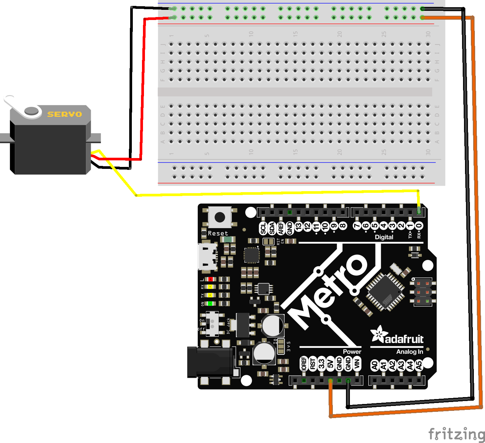

# Continuous Rotational Servos

Continous rotational servos, as their name implies, are servo motors that constantly spin in circles. They can spin in either direction, depending on what direction you set their throttle to. Wiring a servo is easy:

A servo has 3 wires:
* Signal (white or yellow): Attach this to (most) Digital or Analog pin on your board. 
    * Some pins will give you a `all timers already in use for this pin` Serial output. If this happens, try a new pin. 
* Power: Provide 5V, 6V, or 7.4V, depending on your power supply. The more Voltage supplied, the stronger the servo. 
* Ground: Provide a common ground back to your power supply and your microcontroller. 


## Programming

python code [here](rot_servo_high_level.py)
```
# SPDX-FileCopyrightText: 2019 Anne Barela for Adafruit Industries
#
# SPDX-License-Identifier: MIT

"""CircuitPython Essentials Servo continuous rotation servo example"""
import time
import board
import pwmio
from adafruit_motor import servo

# ----------------- INIT DEVICES -------------------------

# create a PWMOut object on Pin D0.
pwm = pwmio.PWMOut(board.D0, frequency=50)

# Create a servo object, my_servo.
my_servo = servo.ContinuousServo(pwm)

while True:
    print("forward")
    my_servo.throttle = 1.0
    time.sleep(2.0)
    print("stop")
    my_servo.throttle = 0.0
    time.sleep(2.0)
    print("reverse")
    my_servo.throttle = -1.0
    time.sleep(2.0)
    print("stop")
    my_servo.throttle = 0.0
    time.sleep(4.0)

```

## Examining The code

### Import Statements
```
import time
import board
import pwmio
from adafruit_motor import servo
```

These imports bring in the necessary libraries:

* time: For time-based functions like delay or sleep.
* board: To access the microcontroller's pins.
* pwmio: Handles "Pulse Width Modulation" signaling, crucial for driving servos.
* adafruit_motor: Contains servo-specific functions from the Adafruit motor control library.


### INITIALIZE Devices

`pwm = pwmio.PWMOut(board.D0, duty_cycle=2 ** 15, frequency=50)` 
Initializes our servo on Pin Digital 0, with a duty cycle of 2 ** 15, and a frequency of 50. 
* The duty cycle of a servo refers to the percentage of time during each pulse cycle that the control signal is in the "on" state. For rotational servos, this duty cycle determines the speed of the servo arm. 
    * A typical servo operates with pulse widths ranging from 1 ms to 2 ms over a 20 ms period:
    * 1 ms might correspond to -100% speed, 1.5 ms to stop, and 2 ms to 100% speed.
* The frequency refers to how often the control signal's pulse cycle repeats per second. 
    * Typically, hobby servos operate at a frequency of 50 Hz, meaning the control signal pulse cycle repeats 50 times per second, or once every 20 milliseconds. 
    * This consistent repetition rate is crucial for maintaining the desired speed of the servo.

`my_servo = servo.ContinuousServo(pwm)` 
creates a servo object, taking special methods from our servo library for controlling our servo. Note that we initialize a continuous servo. 

## While True Loop:
```
while True:
    print("forward")
    my_servo.throttle = 1.0
    time.sleep(2.0)
    print("stop")
    my_servo.throttle = 0.0
    time.sleep(2.0)
    print("reverse")
    my_servo.throttle = -1.0
    time.sleep(2.0)
    print("stop")
    my_servo.throttle = 0.0
    time.sleep(4.0)
```
This loop controls the servo, printing the current action and setting the throttle:

* forward: Throttle set to 1.0 (max forward speed).
* stop: Throttle set to 0.0 (stop).
* reverse: Throttle set to -1.0 (max reverse speed).

You can set the throttle to any value between -1.0 and 1.0:

    -1.0: Max Reverse Speed
    -0.5: 50% Reverse Speed
    0.0: Full Stop
    0.1: 10% Forward Speed
    1.0: Max Forward Speed


