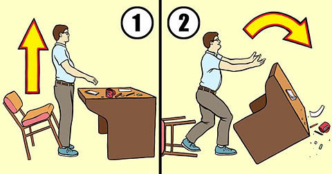

# Positional Servo Challenges (Mars Rovers)
Lets get more practice using positional servos

---

## 1. Modifying the sweep code sleep time

Lets take our sweep code and modify it a bit to further discover the differences between a straight set angle, and a sweep. Run both the sweep and basic angle sets in your while True loop. Attach a single servo (positional) to your breadboard and try the following:

```python
#... init statements & servo setup

while True:
    # basic angles
    print("basic angles")
    my_servo.angle = 0 # set the servo to 0 Degrees, the min point
    time.sleep(1)
    my_servo.angle = 90 # set the servo to 90 Degrees, the midpoint
    time.sleep(1)
    my_servo.angle = 180 #set the servo to 180 Degrees, the max point
    time.sleep(1)

    print("sweeps")
    for angle in range(0, 180, 5):  # "sweep" 0 - 180 degrees, 5 degrees at a time.
        my_servo.angle = angle
        time.sleep(0.05)
    for angle in range(180, 0, -5): # "sweep" 180 - 0 degrees, 5 degrees at a time.
        my_servo.angle = angle
        time.sleep(0.05)
```

* Try to increase or decrease the sleep time inside the `for angle in range` loops. At what point to you notice a difference between a servo sweep, versus a straight angle? How low can you make the sleep occur to notice a difference? 

--- 

## 2. Modifying the sweep code angle change

This time, rather than changing our sleep value, we'll change our angle value each iteration of the loop. 

```python
for angle in range(0, 180, 5):  # "sweep" 0 - 180 degrees, 5 degrees at a time.
        my_servo.angle = angle
        time.sleep(0.05)
    for angle in range(180, 0, -5): # "sweep" 180 - 0 degrees, 5 degrees at a time.
        my_servo.angle = angle
        time.sleep(0.05)
```

* In the `for angle in range(0,180,5)` section of the loop, you've likely been noticing that our angle is increasing by 5 each iteration. 
* Rather than changing our sleep value, now change our angle each loop. At what point is the movement the *smoothest*? At what point is the movement so slow you barely notice a change? 

---

# Challenge: Table Flipping RC Rover
For this challenge, you'll be making a forklift, table flipping RC rover. 


*I'm filled with so much rage - Your Rover (probably)*

Drive Train: 
* x2 rotational servos + ball caster
Hardware:
* x1 positional servo w/ simple forklift arm attached
* FlySky RC Reciever + Transmitter

### Challenge Goals:
1. wire the RC reciever to your rover. We want either the 3 way or 2 way switch Ch6/Ch5 respectively. 
2. Attach a positional servo to the front of your rover. Attach a simple arm to this positional servo. Calibrate this arm's start and stop points. Before you attach your arm:
    * `0 out` your servo: Attach your arm, then rotate your servo horn all the way to the left to achieve `0` degrees on your servo. 
    * Re-attach your servo arm at the rough starting angle. `0*` may not be optimal. 
    * Calibrate your start angle, is `10*` optimal? Test this with simple code. Send an angle, and see what the ideal starting point for your arm is 
    * Then calibrate your ending angle. is `90*` optimal? What works for your design? 
3. When you throw either the 2 way or 3 way switch on, the servo should lift the arm up, as if flipping a table (or an opponent), and vice versa. 

