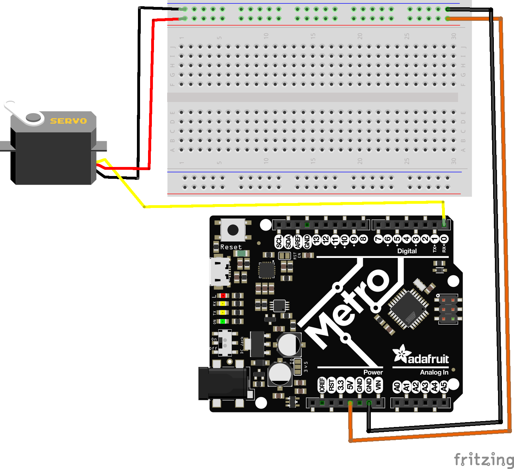

# Positional Servos

Positional servos, unlike continuous rotational servos, are designed to move and hold an angular position within a limited range (typically 0 to 180 degrees). **When you set a servo to a specific degree angle, it will attempt to hold this angle until forces applied to it are greater than its torque output**
* If set a servo to 90* and you apply 5kg/cm of torque to a 10.2kg/cm servo, it will hold the angle
* but if you increase the force applied to greater than 10.2kg/cm, the servo will start to fail and be unable to hold the 90* angle. 

## Video tutorial
[](https://www.youtube.com/watch?v=VO-LuhUMNaA)

***

On our servo mounts, we might have a servo set to 0 degrees:


and a servo set to 180 degrees. 


---

## Wiring a Servo

A servo has 3 wires:
1. **Signal (white or yellow)**: Attach this to most Digital or Analog pins on your board.
    * If you receive a `all timers already in use for this pin` Serial output, try using a different pin.
2. **Power**: Provide 5V, 6V, or 7.4V, depending on your power supply. Higher Voltage generally means stronger servo performance.
3. **Ground**: Connect a common ground to both your power supply and your microcontroller.



You'll find this Servo-Shroud to x3 Male jumper cable helpful when connecting your servo to your breadboard. 


---

## Programming Basic 

python code [here](pos_servo_high_level.py)

```python
# SPDX-FileCopyrightText: 2018 Kattni Rembor for Adafruit Industries
# 2024 Modified by Brogan Pratt for American School of The Hague
# SPDX-License-Identifier: MIT

"""CircuitPython Essentials Servo standard servo example"""
import time
import board
import pwmio
from adafruit_motor import servo

# ----------------- INIT DEVICES -------------------------
# create a PWMOut object on Pin D0.
pwm = pwmio.PWMOut(board.D0, duty_cycle=2 ** 15, frequency=50)

# Create a servo object, my_servo.
my_servo = servo.Servo(pwm)

while True:
    # basic angles
    my_servo.angle = 0 # set the servo to 0 Degrees, the min point
    time.sleep(1)
    my_servo.angle = 90 # set the servo to 90 Degrees, the midpoint
    time.sleep(1)
    my_servo.angle = 180 #set the servo to 180 Degrees, the max point
    time.sleep(1)


```

## Examining The code

### Import Statements
```
import time
import board
import pwmio
from adafruit_motor import servo
```

These imports bring in the necessary libraries:

* time: For time-based functions like delay or sleep.
* board: To access the microcontroller's pins.
* pwmio: Handles "Pulse Width Modulation" signaling, crucial for driving servos.
* adafruit_motor: Contains servo-specific functions from the Adafruit motor control library.


### INITIALIZE Devices

`pwm = pwmio.PWMOut(board.D0, duty_cycle=2 ** 15, frequency=50)` 
Initializes our servo on Pin Digital 0, with a duty cycle of 2 ** 15, and a frequency of 50. 
* Duty Cycle: The percentage of time during each pulse cycle that the control signal is in the "on" state. For positional servos, this duty cycle determines the angle of the servo arm:
    * 1 ms pulse width might correspond to 0 degrees.
    * 1.5 ms pulse width might correspond to 90 degrees.
    * 2 ms pulse width might correspond to 180 degrees.
Here's a visual to help set this knowledge


[source from cytron.io](https://static.cytron.io/image/tutorial/controlling-servo-via-android-smartphone/Servo_Animation.gif)

* Frequency: Typically 50 Hz, meaning the control signal pulse cycle repeats every 20 milliseconds. 
    * This consistent repetition rate is crucial for maintaining the desired angle of the servo.


`my_servo = servo.ContinuousServo(pwm)` 
This creates a servo object with methods specific to positional servos.


## While True Loop:
```
while True:
    # basic angles
    my_servo.angle = 0 # set the servo to 0 Degrees, the min point
    time.sleep(1)
    my_servo.angle = 90 # set the servo to 90 Degrees, the midpoint
    time.sleep(1)
    my_servo.angle = 180 #set the servo to 180 Degrees, the max point
    time.sleep(1)

    for angle in range(0, 180, 5):  # 0 to 180 degrees, 5 degrees at a time.
        my_servo.angle = angle
        time.sleep(0.05)
    for angle in range(180, 0, -5):  # 180 to 0 degrees, 5 degrees at a time.
        my_servo.angle = angle
        time.sleep(0.05)
```
This loop controls the servo by moving it back and forth between 0 and 180 degrees:
* `basic angles`: It is possible to simply state an angle between 0-180, and the servo will hold this angle until a new command is given. 

---

## Programming "Servo Sweeps"

What happens if you want a servo to move slower, or *smoother* than a perfect set angle? This is where a `servo sweep` comes into play. We can "sweep" through the angle changes slower than an instant set degree, allowing for a smoother overall motion. 

```python
    # sweeping angles (Try this inside your forever loop)
    for angle in range(0, 180, 5):  # "sweep" 0 - 180 degrees, 5 degrees at a time.
        my_servo.angle = angle
        print(angle)
        time.sleep(0.05)
    for angle in range(180, 0, -5): # "sweep" 180 - 0 degrees, 5 degrees at a time.
        my_servo.angle = angle
        print(angle)
        time.sleep(0.05)
      

```

### Examining the code 
* `for angle in range(0, 180, 5)`: Slowly increase the angle from 0 to 180 degrees in steps of 5 degrees. The sleep(0.05) function pauses the loop for 0.05 seconds between each step. Each step we increase our angle by 1 degree. 
    * Our `for range` loop also looks different than last time. What looks different? 
* `for angle in range(180, 0, -5)`: Slowly decrease the angle from 180 to 0 degrees in steps of 5 degrees. Again, sleep(0.05) pauses the loop for 0.05 seconds between each step. Each step we increase our angle by 1 degree. 
* This pattern creates a smooth sweeping motion of the servo arm back and forth. 