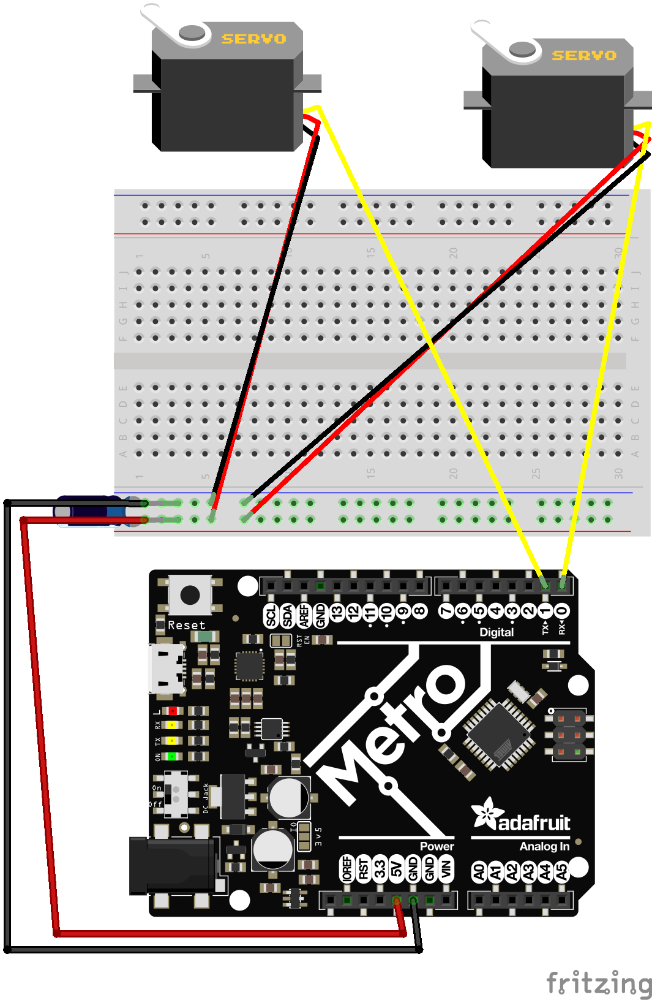
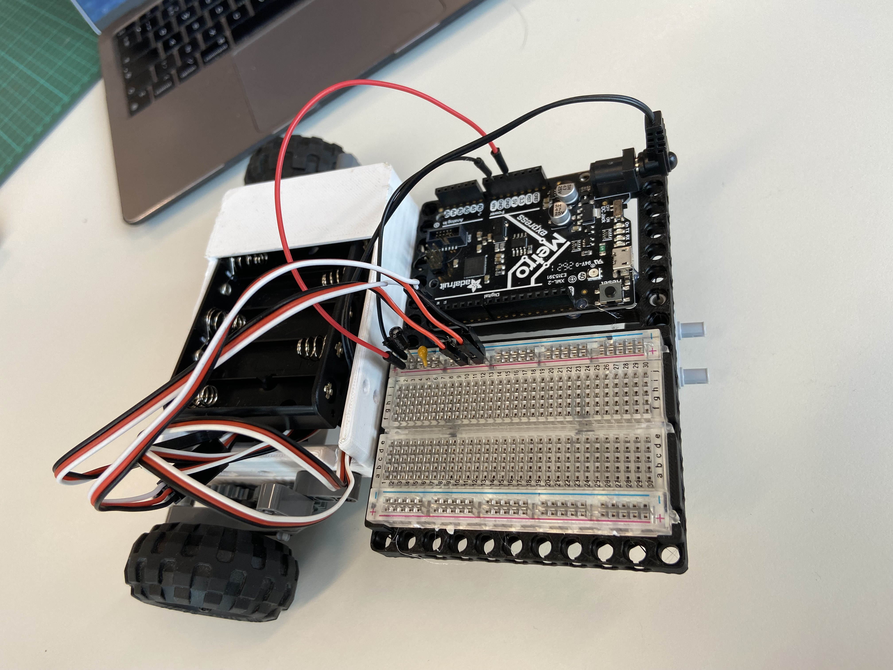

# Rotational Servo Challenges
Now that you know how to program a rotational servo, let's do some challenges to continue to build your knowledge. You'll need several buttons, LEDs, and a rotational servo for this challenge. 

# Wiring your Rover
Let's wire up your rover first. Don't forget your 10uF Capacitor and 0.22uF ceramic capacitor to help filter out some noise. Remember, the closer these capacitors are to your power rail jumpers, the better. 



## 1. Button Controlled Servo:
Using two buttons, make one button turn on your servo and one button turn it off. 

#### Key Design Constraints
* Wiring:
    * Move straight forward for 5 sec
    * stop
    * Move straight reverse for 5 sec
    * stop
    * repeat
* Motor Calibration
    * You need to calibrate your motor throttles individually so that your rover drives forward in a straight line. For example:
        * m1.throttle = 1.0
        * m2.throttle = 1.0
    * May not drive in a straight line. It could be:
        * m1.throttle = 1.0
        * m2.throttle = 0.96

### Define Functions
After calibrating your motor, write your user defined function. Note, *do not include a sleep or pause in your straight function*. It might look something like this:
```python
def straight():
    m1.throttle = 0.5
    m2.throttle = 0.45

```

You may also find it useful to make a `stop()` function as well. These functions will save you having to re-write code multiple times. 
```python
def stop():
    m1.throttle = 0
    m2.throttle = 0
```

### Call Functions
After defining your functions, you'll need to "call" or run them. For example:
```python
while True:
    straight()
    time.sleep(5)  #move straight for 5 sec
    stop()
    time.sleep(5)  #stop for 5 sec
```

## 2. 90 Degree* Turns
Calibrate the motors on your rover so that: 
* Your rover turns 90* left.
* Your rover turns 90* right. \

Ensure you make x2 functions, 1 for `left_turn()` and `right_turn()` respectively. You *should* include a sleep in these functions. 

#### Key Design Constraints
* Code:
    * To turn, rotate one throttle `+` and one throttle `-`
        * m1.throttle = 1.0 
        * m2.throttle = -1.0
    * After starting the motors, `time.sleep(x.x)` for x.x seconds. 
    * How long you pause will determine the number of degrees spun. This is the value you need to calibrate
    * Note your calibration values in your engineering journal. 

## 3. Square Movement
Make your rover: 
* Move forward for 3 seconds
* turn right
* Repeat this x4 **total times** to draw a square with your rover. 