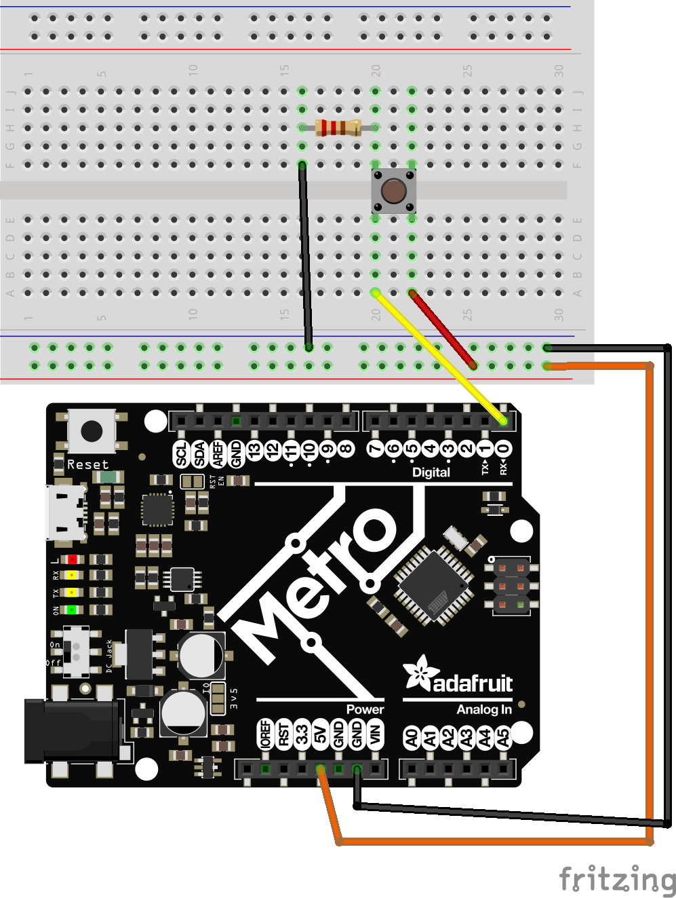

# Rotational Servo Challenges
Now that you know how to program a rotational servo, let's do some challenges to continue to build your knowledge. You'll need several buttons, LEDs, and a rotational servo for this challenge. 

# Wiring Capacitors
Don't forget your 10uF Capacitor and 0.22uF ceramic capacitor to help filter out some noise. Remember, the closer these capacitors are to your power rail jumper wires, the better. 

## 1. Button Controlled Servo:
Using two buttons, make one button turn on your servo and one button turn it off. 

#### Key Design Constraints
Wiring:
* x2 buttons wired to Digital Pins (5v wired + 330ohm resistors)
* x1 Rotational Servo
* 10uF Capacitor
* 0.22uF ceramic capacitor

!Don't forget how to wire your buttons as digital INPUTs with resistors.  


Code:
* Ensure you've [calibrated](rot_calibrate.py) the stop value of your servo 
* should be running inside a `while True` loop
* if button 1 is pressed, set servo to `0.5` throttle
* if button 2 is pressed, set servo to `0` throttle (or other stop value)
* you need no `else` statements

Starter Code:
```python
import board
from digitalio import DigitalInOut, Direction, Pull
import time

switch = DigitalInOut(board.D5)
switch.direction = Direction.INPUT  # input for sensors
switch.pull = Pull.UP   # Pull.Up/Down is used for switches

while True:
    button1 = switch.value
    # add your 2nd button reading
    if not button1:  
        print("Pressed button 1!")
        # add your servo control
    # add your 2nd button condition & servo control in an additional if statement
    # you need no else statement in this code. 

    time.sleep(0.01)  # add a small sleep to prevent overrunning loops
```

## 2. Button Controlled Servo + Debug LEDs

It can be helpful to have a visual representation for our users as to what "speed" a servo is currently running at. Add in x2 external LEDs that turns on #1 when the servo runs, and turns on #2 when the servo is stopped. 

#### Key Design Constraints
Wiring:
* Same constraints as Challenge #1. Additionally: 
* x2 external LEDS connected to digital pins (3v3V or 5V)

Code:
* When the servo is spinning, LED1 is ON and LED2 is OFF
* When servo is stopped, LED1 is OFF and LED2 is ON

Starter Code:
```python
import board
from digitalio import DigitalInOut, Direction, Pull
import time

led = DigitalInOut(board.D3)
led.direction = Direction.INPUT

switch = DigitalInOut(board.D5)
switch.direction = Direction.INPUT  # input for sensors
switch.pull = Pull.UP   # Pull.Up/Down is used for switches

while True:
    button1 = switch.value
    # add your 2nd button reading
    if not button1:  
        print("Pressed button 1!")
        # add your servo control
        led.value = True
        # turn off your other LED
    # add your 2nd button condition, servo control, and 2nd LED logic

    time.sleep(0.01)  # add a small sleep to prevent overrunning loops
```

## 3. Additional Speeds
Add in an additional button + LED. Can you make the servo run at 2 different speeds, for low and high? 