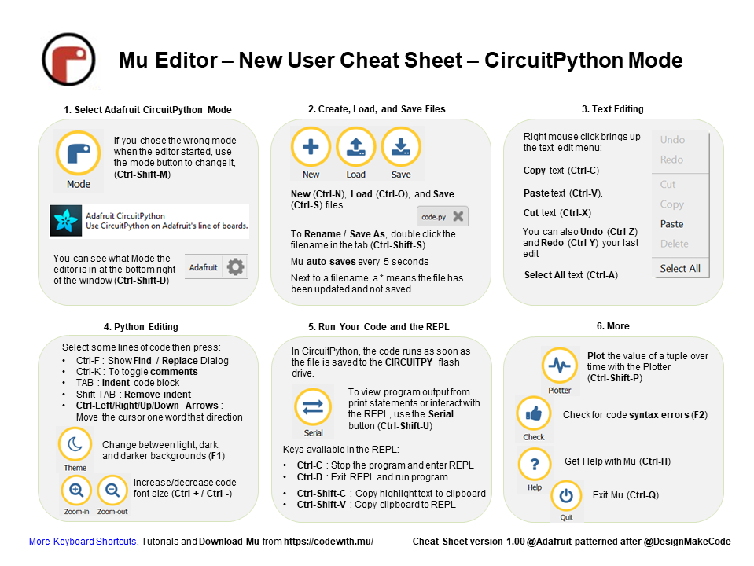
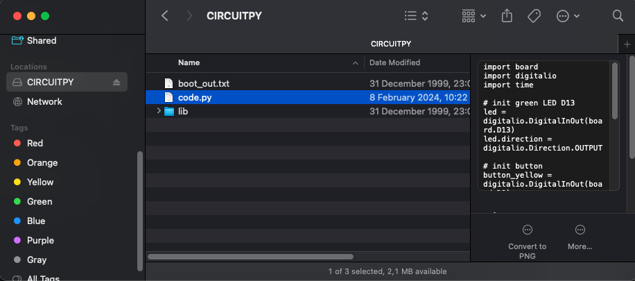
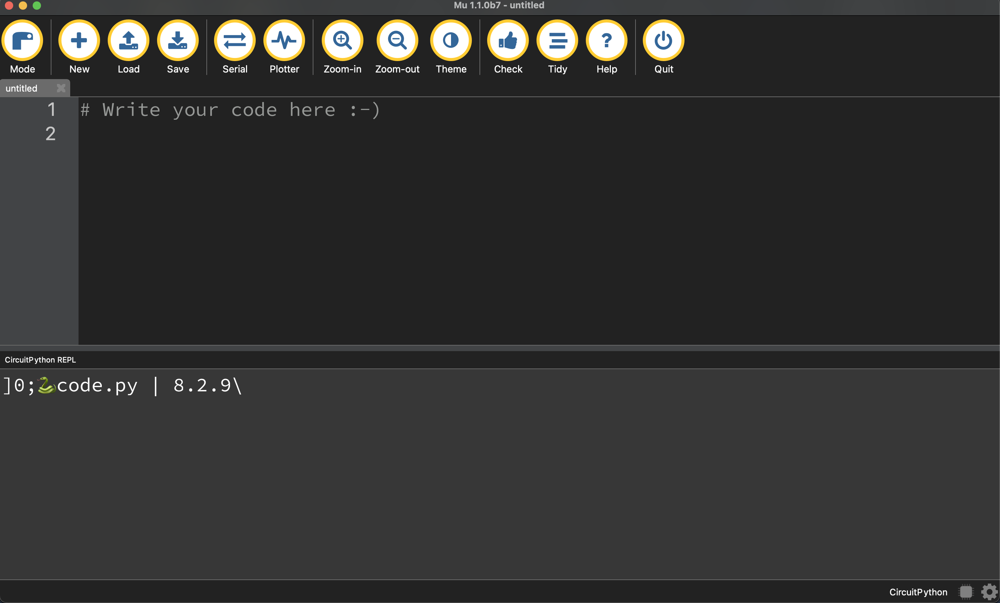

# Circuit Python Basics 

For this course, we'll be programming in circuit python. It's Python, but with added bits for controlling electronics!

In this first tutorial, we'll learn:
* how to connect our M4 to our computer
* how to connect our M4 board's "serial console"
* how to write "print" statements
* how to save/write code to our python board
* how to communicate with our microcontroller via the serial console

###  Installing Mu and Connecting your M4 board
1. Follow [this link](https://codewith.mu/en/download) to install the mu editor on your computer. 
2. Open the Mu Editor. 
3. Select "Circuit Python" as your target programming language
4. Connect your microcontroller (M4) to your Mac via Micro USB. 

### Mu Basics
Here's a simple cheat sheet for how to use various functions in the Mu Editor. 


# Saving &  Running Code
Let's write our first program. Programs are a set of instructions that get executed/carried out by a computer. Generally, these programs have user inputs, and outputs. Let's write our first physical program that has our microcontroller talking back to us via our "serial console". With your M4 connected to your computer via USB:
1. In Mu, Click "Load"
2. Navigate to the "CircuitPy" drive in your finder
3. Select "code.py" to open


4. "CMD-A" to select all code, and delete, so we're starting with a fresh canvas. 
5. on line 1, write: 
` print("Hello Python!) `
6. In Mu, press on "Serial" to open your serial console. (This is what our M4 tells to us)

7. Press "Save". 
### **Your code changes are run as soon as the file is done saving. Do not press the reset button or unplug.**
- If you unplug or reset the board before your computer finishes writing the file to your board, you can corrupt the drive. 
- If this happens, you may lose the code you've written, so it's important to backup your code to your computer regularly.


8. You should now see in the serial console below, with your print statement
9. Try writing and saving a few more print statements onto the code.py file like so:
``` 
print("hello Python!)
print("this is line 2!)
print("and I'm a serial console talking to you)
```

### Quick Links
* [Home](/README.md)
* [Tutorials](/learning_modules/tutorials_list.md)
* [Circuit Python Cheat Sheet](/learning_modules/circuit_python_cheatsheet.md)