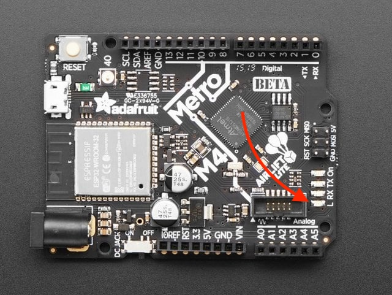
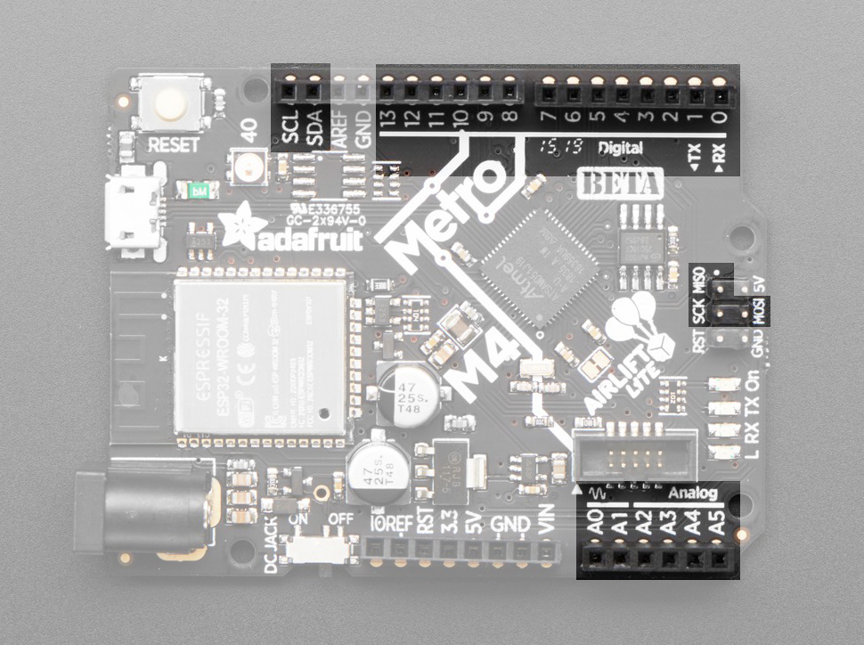
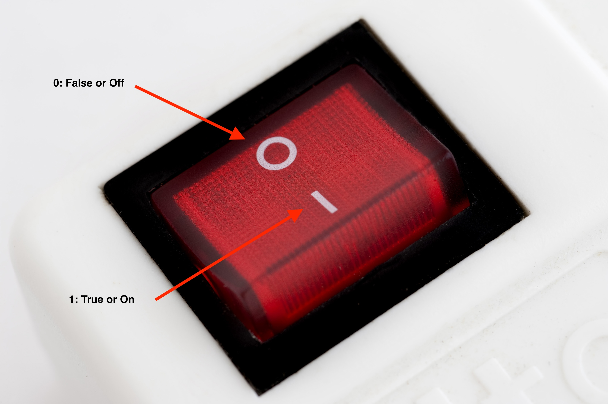

# Digital IO (In/Out)
Let's get into our first physical component. We're going to make our onboard LED blink on the M4 board. 

The onboard LED is a red LED with the "L" next to it. By the end of this tutorial, you'll be able to turn this on and off. 



The rest of this tutorial is borrowed/modified from this [AdaFruit Tutorial](https://learn.adafruit.com/welcome-to-circuitpython/creating-and-editing-code) and has been modified to suit the needs of this course. 

## Practice Code
copy and paste the [following code](learning_modules/programming_tutorials/digital_io/blinking_led.py) into your code.py and run it on your board
```
import board
import digitalio
import time

led = digitalio.DigitalInOut(board.LED)
led.direction = digitalio.Direction.OUTPUT

while True:
    led.value = True
    time.sleep(0.5)
    led.value = False
    time.sleep(0.5)
```

The little LED should now be blinking. Once per half-second.

Congratulations, you've just run your first CircuitPython program to make physical hardware function!

# Code Breakdown

### Libraries & Modules
At the top of the code, you see 3 *import* statements
```
import board
import digitalio
import time
```

CircuitPython is designed to run on microcontrollers and allows you to interface with all kinds of sensors, inputs and other hardware peripherals. Unlike standard Python, most CircuitPython code includes *hardware setup* which requires various modules, such as `board` or `digitalio`. You import these modules and then use them in your code. 
* A "module" is a library or piece of code that has been written for you and allows you to extend your code beyond normal capabilities. 
* in the code above, we imported 3 modules
    - board 
        - this tells us what pins we can use and what hardware/sensors exist on the metro M4
    - digital io   
        * think about chrome extensions. Ublock origin is a "module" that adds ad-blocking functionality to your browser. `digitalio` adds the ability to use digital sensors (INputs) or devices (OUTputs), hence, digital**io** (digital in/out)
        * digital sensors are simply on or off, like a light switch. The switch is our digital IN sensor, and the light itself is the digital OUT (on/off)
    - time
        - allows us to use time based functions like pauses, timers, etc. 

### LED Initialization
below our import statements, we have 2 lines
```
led = digitalio.DigitalInOut(board.LED)
led.direction = digitalio.Direction.OUTPUT
```

`led = digitalio.DigitalInOut(board.LED)` creates a digital object variable called *led* and assigns it a digital in/out (io) pin. Looking at the board below, we have:
* 14 Digital In/Out pins
    - These can turn lights on/off, or read on/off sensors
* 6 Analog In/Out pins 
    - these can output a range of values, like a volume slider. They can also import a range of values from an analog sensor, like a microphone, noise sensor, light sensor, temperature sensor, etc.


`led.direction = digitalio.Direction.OUTPUT` sets the direction of our digital object.
- INPUT: would be for a sensor. like a button or a light switch. We want to *read* values from sensors, so the object connected to this pin is an input. 
- OUTPUT: would be a light, motor, or other device that we want to *write* values to. Turn light on/off, etc. 

### while True:
Now we start our main loop. Note the indentation of the while True loop, similar to a list in a word doc:
* Main list item
    * Sub list item #1
    * Sub list item #2
* New list
```
while True:
    led.value = True
    time.sleep(0.5)
    led.value = False
    time.sleep(0.5)
```

`led.value = True` tells us to send a 3.3v signal over our pin to turn ON the digital device. This is known as it's `value`, which can be boolean, True or False. True is on, False is off, or 1 is on, 0 is off, much like a power switch. 


`time.sleep(0.5)` takes the time module, and calls the `sleep` method. This is a handy "method/function" from the time library/module that lets us take breaks in second incriments. Similar to `led.value`, it uses something called *dot notation*, which means we can write a module/variable, then a `.` dot, and we get a list of methods that we can use from this object. 

* After this, we run all 4 lines, then repeat back to the top of our `while True:` loop, repeating this .5sec on, .5sec off loop forever. 
* Go ahead and change the value of `time.sleep(0.5)` to something like `(1)` or `(0.1)`. What changes to you observe to the LED? 

##### Quick Links
* [Home](README.md)
* [Tutorials](learning_modules/tutorials_list.md)
* [Circuit Python Cheat Sheet](learning_modules/circuit_python_cheatsheet.md)