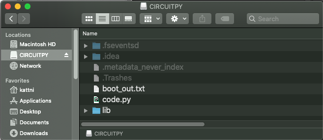
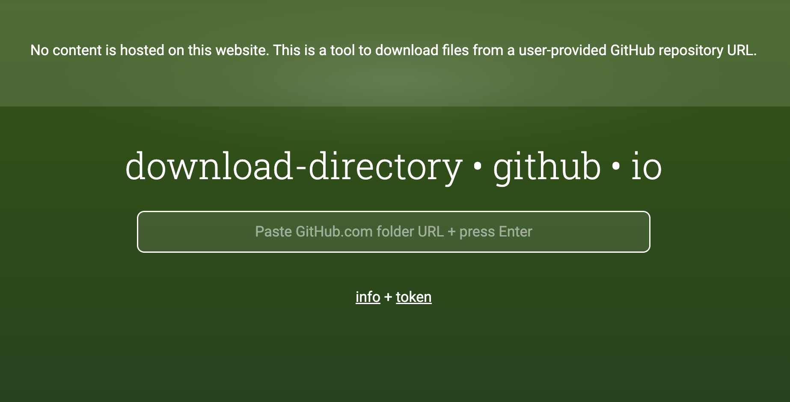
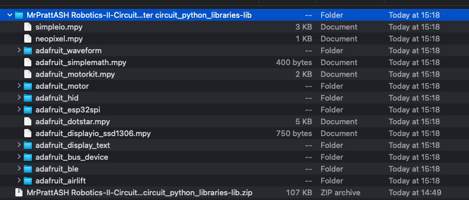
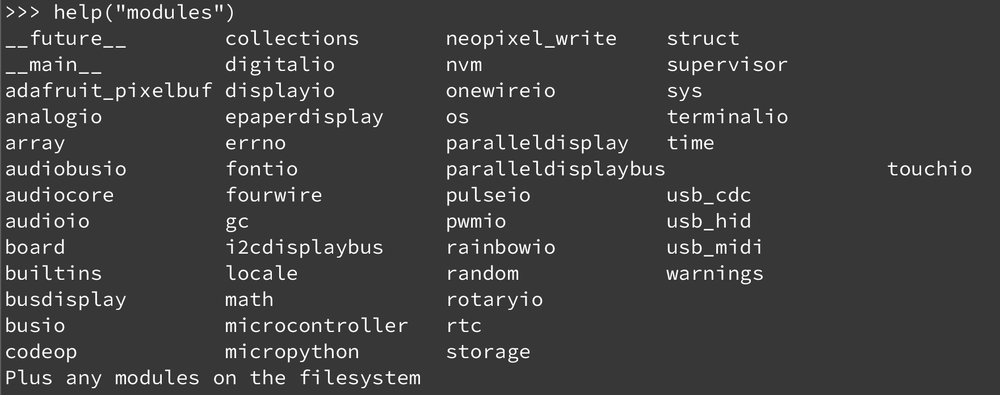
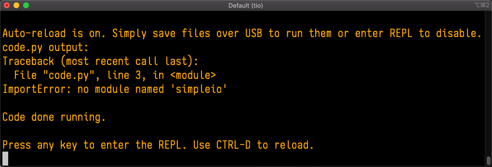
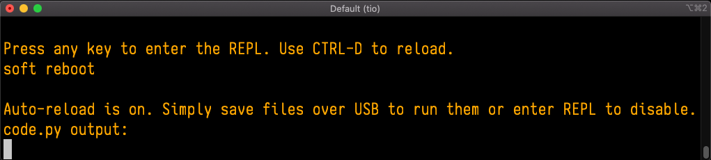

# Libraries
*This tutorial has been modified from AdaFruit's Tutorial on Libraries [here](https://learn.adafruit.com/welcome-to-circuitpython/circuitpython-libraries)*

Each CircuitPython program you run needs to have a lot of information to work. The reason CircuitPython is so simple to use is that most of that information is stored in other files and works in the background. These files are called libraries. Some of them are built into CircuitPython. Others are stored on your CIRCUITPY drive in a folder called lib. Part of what makes CircuitPython so great is its ability to store code separately from the firmware itself. Storing code separately from the firmware makes it easier to update both the code you write and the libraries you depend.

Your board may ship with a lib folder already, it's in the base directory of the drive. If not, simply create the folder yourself. When you first install CircuitPython, an empty lib directory will be created for you. In this course, your teacher has created a base set of libraries for you that you'll need for running code. Generally* the libraries you need are already loaded on your board, but not always. 



CircuitPython libraries work in the same way as regular Python modules so the [Python docs](https://docs.python.org/3/tutorial/modules.html) are an excellent reference for how it all should work. In Python terms, you can place our library files in the lib directory because it's part of the Python path by default.

One downside of this approach of separate libraries is that they are not built in. To use them, one needs to copy them to the CIRCUITPY drive before they can be used. Fortunately, there is a library bundle that I've compiled for you. 

Due to the regular updates and space constraints, Adafruit does not ship boards with the entire bundle. Therefore, you will need to load the libraries you need when you begin working with your board. You can find example code in the guides for your board that depends on external libraries.

Either way, as you start to explore CircuitPython, you'll want to know how to get libraries on board.

## Downloading Libraries

Navigate over to [download-directory ](https://download-directory.github.io/)



Copy and paste the following URL to download the course lib file from our course repo. 
`https://github.com/MrPrattASH/Robotics-II-Circuit-Python/tree/master/circuit_python_libraries/lib`

When you open the zip, you'll find some nested directories. Navigate through them until you find what you need. 


## Copying Libraries to Your Board
First open the **lib** folder on your **CIRCUITPY** drive. Then, open the lib folder you extracted from the downloaded zip. Inside you'll find a number of folders and .mpy files. Find the library you'd like to use, and copy it to the **lib** folder on **CIRCUITPY**.

If the library is a directory with multiple .mpy files in it, be sure to **copy the entire folder to CIRCUITPY/lib.**

## Understanding Which Libraries to Install
You now know how to load libraries on to your CircuitPython-compatible microcontroller board. You may now be wondering, how do you know which libraries you need to install? Unfortunately, it's not always straightforward. Fortunately, there is an obvious place to start, and a relatively simple way to figure out the rest. First up: the best place to start.

When you look at most CircuitPython examples, you'll see they begin with one or more import statements. These typically look like the following:
`import library_or_module`

However, import statements can also sometimes look like the following:

```
from library_or_module import name
from library_or_module.subpackage import name
from library_or_module import name as local_name
```

The important thing to know is that an import statement will *always include the name of the module or library* that you're importing.

Therefore, the best place to start is by reading through the import statements.

Here is an example import list for you to work with in this section. There is no setup or other code shown here, as the purpose of this section involves only the import list.

```
import time
import board
import neopixel
from adafruit_motor import servo
from rc import rc
```

Keep in mind, not all imported items are libraries. Some of them are almost always built-in CircuitPython modules. How do you know the difference? Time to visit the REPL. 

The following is the list of modules built into CircuitPython for the Metro M0 Express.


Now that you know what you're looking for, it's time to read through the import statements. The first two, `time` and `board`, are on the modules list above, so they're built-in.

The next one, `neopixel`, is not on the module list. That means it's your first library! So, you would head over to the bundle zip you downloaded, and search for neopixel. There is a neopixel.mpy file in the bundle zip. Copy it over to the lib folder on your CIRCUITPY drive. 

Often all of the built-in modules come first in the import list, but sometimes they don't! Don't assume that everything after the first library is also a library, and verify each import with the modules list to be sure. Otherwise, you'll search the bundle and come up empty!

The final 2 imports are not as clear. Remember, when import statements are formatted like this, the first thing after the from is the library name. In this case, the library name is `rc`. A search of the bundle will find an `rc.py` file. For `adafruit_motor`, the library is a folder rather than single file. When a library is a folder, you must copy the entire folder and its contents as it is in the bundle to the lib folder on your CIRCUITPY drive. In this case, you would copy the entire `adafruit_motor` folder to your CIRCUITPY/lib folder.

That is how you can use your example code to figure out what libraries to load on your CircuitPython-compatible board!

There are cases, however, where libraries require other libraries internally. The internally required library is called a dependency. In the event of library dependencies, the easiest way to figure out what other libraries are required is to connect to the serial console and follow along with the ImportError printed there. The following is a very simple example of an ImportError, but the concept is the same for any missing library.

## Example: ImportError Due to Missing Library
If you choose to load libraries as you need them, or you're starting fresh with an existing example, you may end up with code that tries to use a library you haven't yet loaded.  This section will demonstrate what happens when you try to utilise a library that you don't have loaded on your board, and cover the steps required to resolve the issue.

*This demonstration will only return an error if you do not have the required library loaded into the lib folder on your CIRCUITPY drive.*

Let's use a modified version of the Blink example.
```
import board
import time
import simpleio

led = simpleio.DigitalOut(board.LED)

while True:
    led.value = True
    time.sleep(0.5)
    led.value = False
    time.sleep(0.5)

```
Save this file. Nothing happens to your board. Let's check the serial console to see what's going on.



You have an `ImportError`. It says there is `no module named 'simpleio'`. That's the one you just included in your code!

Click the link above to download the correct bundle. Extract the lib folder from the downloaded bundle file. Scroll down to find simpleio.mpy. This is the library file you're looking for! Follow the steps above to load an individual library file.

The LED starts blinking again! Let's check the serial console.



No errors! Excellent. You've successfully resolved an `ImportError`!

If you run into this error in the future, follow along with the steps above and choose the library that matches the one you're missing.

## Updating CircuitPython Libraries and Examples
Libraries and examples are updated from time to time, and it's important to update the files you have on your CIRCUITPY drive.

To update a single library or example, follow the same steps above. When you drag the library file to your lib folder, it will ask if you want to replace it. Say yes. That's it!