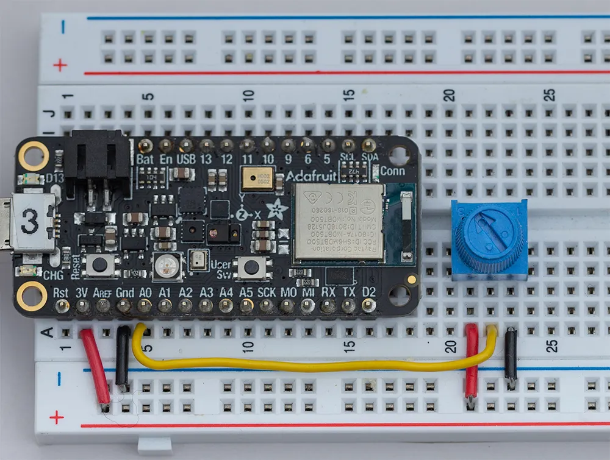

# CircuitPython - Scaling Values with `map_range`

This page will show you how to use the `simple_math` library to translate numbers from one range to another. This is one of the most useful math tools in robotics!

Imagine you have a sensor that gives you a number between **0 and 65535**, but you need to control a motor that only understands **0 to 100**. Instead of doing complex math, we use `map_range`.

### Required library
Ensure you have the [adafruit_simplemath](../../../circuit_python_libraries/lib/adafruit_simplemath.mpy) python file on your `CIRCUITPY` device. 

---

# 1. Hardware Setup

For these exercises, we will use a **Potentiometer** (a twisting knob) to provide our input signal.

### Wiring the Potentiometer
A potentiometer has three pins. On your Metro M4:
1.  **Right Pin:** Connect to **GND**
2.  **Middle Pin (Signal):** Connect to **A0**
3.  **Left Pin:** Connect to **3.3V**



---

# 2. Programming with `map_range`

### 1. Mapping to a Percentage (0 - 100)
By default, the Metro M4 reads analog inputs as a 16-bit integer (0 to 65535). That’s a huge, clunky number! Let’s map that range so it feels like a volume knob going from **0% to 100%**.

```python
import time
import board
from analogio import AnalogIn
from adafruit_simplemath import map_range

# Setup the potentiometer on pin A0
pot = AnalogIn(board.A0)

while True:
    # 1. Get the raw value (0 to 65535)
    raw_value = pot.value
    
    # 2. Use map_range(Value_to_map, min_in, max_in, min_out, max_out)
    percentage = map_range(raw_value, 0, 65535, 0, 100)
    
    print("Raw:", raw_value, " -> Percentage:", int(percentage), "%")
    
    time.sleep(0.1)
```

### Experiment
Modify the code so that the output range is **-50 to 50**. This is useful if you want the center of the knob to represent "0" (neutral).

<details>
<summary>Click to reveal a hint</summary>
<pre><code>
# Change the last two numbers in the map_range function.
# map_range(raw_value, 0, 65535, NEW_MIN, NEW_MAX)
</code></pre>
</details>

<details>
<summary>Click to reveal a solution</summary>
<pre><code>
while True:
    raw_value = pot.value
    # Map from 0-65535 to -50 to 50
    centered_value = map_range(raw_value, 0, 65535, -50, 50)
    
    print("Position:", int(centered_value))
    time.sleep(0.1)
</code></pre>
</details>

---

## 2. Controlling Brightness (0.0 - 1.0)
Many values in CircuitPython (like LED brightness or Servo angles) use specific ranges. The built-in NeoPixel on your Metro M4 uses a brightness range of **0.0 (off) to 1.0 (full blast)**. 

Because `map_range` handles "floats" (decimal numbers), it makes this conversion very easy.

```python
import time
import board
import neopixel
from analogio import AnalogIn
from adafruit_simplemath import map_range

# Setup hardware
pot = AnalogIn(board.A0)
pixel = neopixel.NeoPixel(board.NEOPIXEL, 1)

while True:
    # Map the 0-65535 pot value to a 0.0-1.0 brightness float
    brightness_val = map_range(pot.value, 0, 65535, 0.0, 1.0)
    
    # Apply the brightness and turn the pixel Blue
    pixel.brightness = brightness_val
    pixel.fill((0, 0, 255)) # B, G, R values for colour
    
    print("Current Brightness:", brightness_val)
    time.sleep(0.05)
```

### Experiment
Make the NeoPixel change **Color** instead of brightness. 
* Fix the brightness at `0.2`.
* Map the potentiometer so that at one end the LED is **Black (0, 0, 0)** and at the other end it is **Bright Red (255, 0, 0)**.

<details>
<summary>Click to reveal a hint</summary>
<pre><code>
# 1. Create a variable called 'red_value'
# 2. Map the pot.value from (0, 65535) to (0, 255)
# 3. Use: pixel.fill((red_value, 0, 0))
</code></pre>
</details>

<details>
<summary>Click to reveal a solution</summary>
<pre><code>
pixel.brightness = 0.2 # Keep it dim so it doesn't hurt your eyes!

while True:
    # Map to RGB color range (0-255)
    red_val = map_range(pot.value, 0, 65535, 0, 255)
    
    # Apply the mapped value to the Red channel
    pixel.fill((int(red_val), 0, 0))
    
    time.sleep(0.05)
</code></pre>
</details>

---

### Why use this instead of normal math?
While you *could* just divide your input by 655, `map_range` is better because:
1.  **It handles "Inversion":** You can map `0-65535` to `100-0` to make the knob work backwards.
2.  **It handles different data types:** It automatically manages the transition between large integers and small decimals.
3.  **Readability:** Anyone reading your code knows exactly what your intended "input" and "output" ranges are. No need for "magic" numbers! 