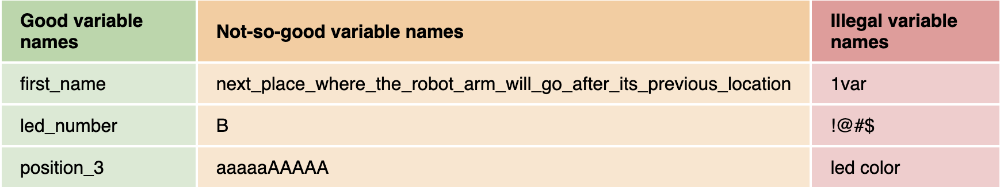

# Variables in Python 
A variable is a "bucket" that we can use to store data. In Python, we can save data like numbers, words, letters, True/False, or more types of values inside of **variables**. Much like in math, we also use variables in programming.
```python
# In math:
x = 5
y = 2
z = x + y

# In Programming:
distance = 12
speed = 95.5
name = "rover_1"
is_driver_controlled = True
```
The main difference between variables in math, and in programming, are that:
1. We use *much more descriptive names* in programming. "x" becomes "distance". It's a way that we can *abstract away complexity* in our code through proper naming. 
    - "z = y * x" is much harder to understand than "distance = speed * time"
2. We can store more than numbers in variables in programming:
- Numbers *(0, 4, 123)*: We call these variables "integers" or "Int"
- Decimal Numbers *(0.43, 8.8)*: We call these variables "floats" as they are floating point numbers
- Words & Letters *("hello:, "J", "rover_1"): We call these variables "strings" or "str" as they are strings of characters. Note: **all strings are surrounded by "quotation marks"**
- True/False: We call these variables "Booleans" or "Bool". They only store True or False values. Useful for storing states like "light_on" or "motors_running".
3. the variables above are **assignment statements**. We are "assigning" values to these variables using a single = sign. 
These are the main 4 types of variables that we'll use in this course. More exist, but this will cover the basics. 

## Variable Practice 1
1. Plug in your metro M4 board to your computer, open code.py, and open the serial port. 
2. create 4 different variables, one of each type. For example:
```python
power = 5
light_intensity = 84.8
rover_name = "Jenkins"
has_rc_control = True
```
3. After creating 4 variables, print each variable and observe the output. Notice, we *do not put variable names "in between quotes"* as only string variable values are in between "quotes". 

```python
print(power)
print(light_intensity)
print(rover_name)
print(has_rc_control)

print("power")
print("light_intensity")
print("rover_name")
print("has_rc_control")
```

4. Observe the differences between these 2 sets of print statements.
    - The first set printed the *values* of the variables
    - The second set printed 4 different "string variables", rather than their variable values, because all 3 were surrounded by "quotation marks" 
5. See below for legal vs "illegal" variable names in Python

[image credit](https://sites.google.com/view/circuitpython/tutorials/set-up/hello-python)
6. Another convention in naming variables in python is that all names are in lower case. If we have to have multiple words, we_separate_them_with_an_underscore. This is called "snake_case", a well fitting name for Python. 

## Variable Practice 2
1. Observe what happens to the following code in your serial output:
```python
distance = 50
print(distance)
distance = 12
print(distance)
```
2. This is an example of *sequencing*. All code runs sequentially, Top down. We can *re-assign* variables new values later on in code. 
3. Try it for yourself. 
- create a new integer variable and assign it a default value
- print your variable
- re-assign your variable to a new value
- print your variable again

## Variable Practice 3
Just like in math, we can also use arithmatic operators on variables. 
```python
+ add
- subtract
* multiplication
/ division
// integer division (no decimals)
% Modulus (remainder division)
```
Try this:
```python
time = 10
speed = 40
distance = time * speed
print(distance)
```

Copy and paste the following code inside code.py. Then, follow the #code comments to practice arithmatic operators in Python:
``` python
# Note: any line that starts with a "#" hashtag, is a special line in Python
# it is a "code comment", something that is useful for you, but the computer ignores

# don't change these variables
wallet = 25
bank_account = 50
kaas_broodje = 2.25


# assign total money to the sum of wallet and bank_account
total_money = 

# You now purchase a kaas broodje from your wallet. subtract this value from total_money and form your wallet. 
total_money = total_money - 
wallet = wallet - 


#print all 3 values. Don't change these print statements. They'll print first the string, then the value of the variable listed after the comma
print("Total sum in wallet:", wallet)
print("Total sum in Bank:, bank_account)
print("Total money all together:", total_money)
```